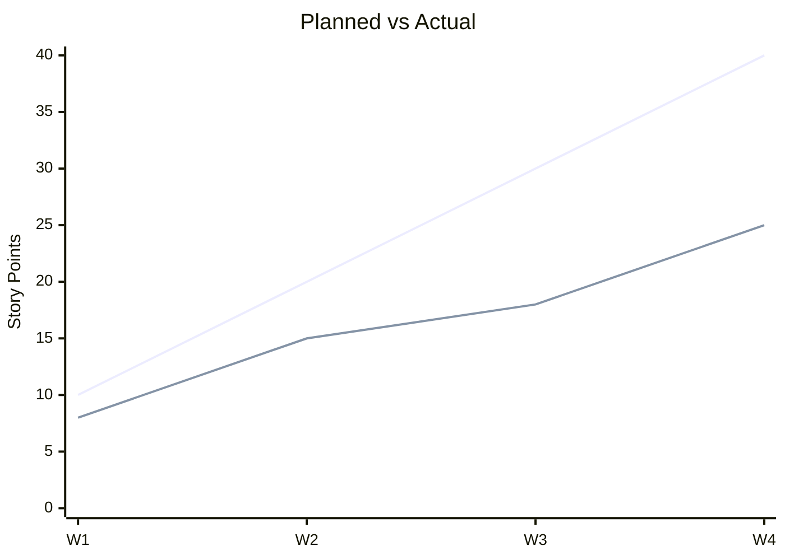

# expense-reporter

```mermaid
xychart-beta
    title "Planned vs Actual"
    x-axis ["W1", "W2", "W3", "W4"]
    y-axis "Story Points" 0 --> 40
    line "Planned" [10, 20, 30, 40]
    line "Actual" [8, 15, 18, 25]
```
