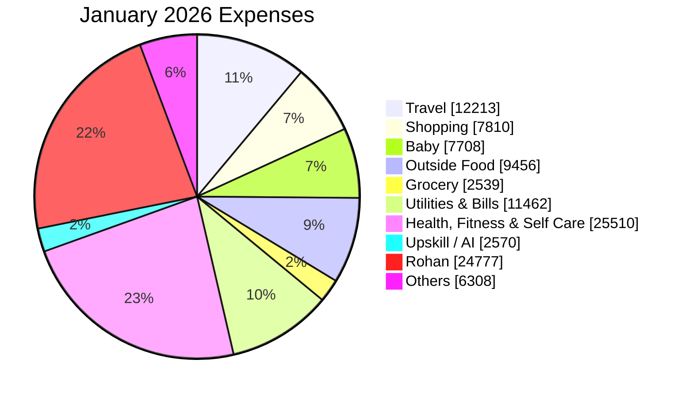

# Expense Report — January 2026

_Generated: 2026-08-02_

## Summary

| Category | January 2026 |
| --- | --- |
| Travel | ₹12,213 |
| Shopping | ₹7,810 |
| Baby | ₹7,708 |
| Outside Food | ₹9,456 |
| Grocery | ₹2,539 |
| Utilities & Bills | ₹11,462 |
| Health, Fitness & Self Care | ₹25,510 |
| Upskill / AI | ₹2,570 |
| Rohan | ₹24,777 |
| Others | ₹6,308 |
| **Total** | **₹110,353** |

---

```mermaid
xychart-beta
    title "Monthly Expense Trend (Rs thousands)"
    x-axis ["Jan '26"]
    y-axis "Rs Thousands" 0 --> 50
    line "Travel" [12.2]
    line "Shopping" [7.8]
    line "Baby" [7.7]
    line "Outside Food" [9.5]
    line "Grocery" [2.5]
    line "Utilities & Bills" [11.5]
    line "Health, Fitness & Self Care" [25.5]
    line "Upskill / AI" [2.6]
    line "Rohan" [24.8]
    line "Others" [6.3]
```

**Lines:** Travel · Shopping · Baby · Outside Food · Grocery · Utilities & Bills · Health, Fitness & Self Care · Upskill / AI · Rohan · Others




---

## Travel

| Date | Merchant | Card | Amount |
| ---- | -------- | ---- | ------:|
| Jan 01 | MG Noida Authority | Paytm | ₹32 |
| Jan 02 | IGST (Fuel Surcharge) | — | ₹11 |
| Jan 04 | IGST (Fuel Surcharge) | — | ₹1 |
| Jan 04 | IGST (Fuel Surcharge) | — | ₹1 |
| Jan 06 | IGST (Fuel Surcharge) | — | ₹1 |
| Jan 06 | Parking | Paytm | ₹60 |
| Jan 07 | Parking | Paytm | ₹60 |
| Jan 08 | IGST (Fuel Surcharge) | — | ₹4 |
| Jan 14 | IGST (Fuel Surcharge) | — | ₹10 |
| Jan 14 | IDBI FASTag | Paytm | ₹500 |
| Jan 15 | IGST (Fuel Surcharge) | — | ₹1 |
| Jan 15 | IGST (Fuel Surcharge) | — | ₹1 |
| Jan 15 | IGST (Fuel Surcharge) | — | ₹1 |
| Jan 15 | MGF Metropolitan Parking | Paytm | ₹50 |
| Jan 15 | Parking | Paytm | ₹60 |
| Jan 17 | IGST (Fuel Surcharge) | — | ₹1 |
| Jan 17 | IGST (Fuel Surcharge) | — | ₹1 |
| Jan 18 | Viaggio Services | Paytm | ₹50 |
| Jan 19 | IGST (Fuel Surcharge) | — | ₹9 |
| Jan 20 | IGST (Fuel Surcharge) | — | ₹1 |
| Jan 20 | IGST (Fuel Surcharge) | — | ₹1 |
| Jan 21 | Parking | Paytm | ₹60 |
| Jan 22 | IGST (Fuel Surcharge) | — | ₹1 |
| Jan 22 | IGST (Fuel Surcharge) | — | ₹1 |
| Jan 23 | IGST (Fuel Surcharge) | — | ₹1 |
| Jan 23 | Fuel | ICICI Emeralde | ₹1,032 |
| Jan 24 | Fuel Surcharge ↩ Refund | ICICI Emeralde | (₹10) |
| Jan 24 | Fuel Surcharge (GST) ↩ Refund | ICICI Emeralde | (₹2) |
| Jan 24 | IDBI FASTag | Paytm | ₹509 |
| Jan 25 | DLF Mall Parking | Paytm | ₹80 |
| Jan 26 | IGST (Fuel Surcharge) | — | ₹8 |
| Jan 26 | HP Fuel | Paytm | ₹2,020 |
| Jan 27 | Parking | Paytm | ₹60 |
| Jan 28 | IGST (Fuel Surcharge) | — | ₹40 |
| Jan 28 | IGST (Fuel Surcharge) | — | ₹3 |
| Jan 28 | Fuel | ICICI Emeralde | ₹3,086 |
| Jan 29 | Fuel Surcharge ↩ Refund | ICICI Emeralde | (₹31) |
| Jan 29 | Fuel Surcharge (GST) ↩ Refund | ICICI Emeralde | (₹6) |
| Jan 30 | Fuel | — | ₹3,035 |
| Jan 30 | Fuel Surcharge ↩ Refund | — | (₹30) |
| Jan 30 | IDBI FASTag | Paytm | ₹1,500 |
| | **Total** | | **₹12,213** |

## Shopping

| Date | Merchant | Card | Amount |
| ---- | -------- | ---- | ------:|
| Jan 11 | Flipkart | — | ₹618 |
| Jan 11 | Amazon Pay | — | ₹4,499 |
| Jan 13 | Amazon Pay ↩ Refund | — | (₹999) |
| Jan 17 | Amazon Pay ↩ Refund | — | (₹1,597) |
| Jan 18 | Decathlon | PhonePe | ₹299 |
| Jan 25 | Uniqlo | ICICI Emeralde | ₹4,990 |
| | **Total** | | **₹7,810** |

## Baby

| Date | Merchant | Card | Amount |
| ---- | -------- | ---- | ------:|
| Jan 25 | FirstCry | ICICI Emeralde | ₹829 |
| Jan 25 | FirstCry | ICICI Emeralde | ₹2,030 |
| Jan 26 | FirstCry | ICICI Emeralde | ₹3,075 |
| Jan 26 | FirstCry | ICICI Emeralde | ₹2,000 |
| Jan 31 | FirstCry ↩ Refund | ICICI Emeralde | (₹225) |
| | **Total** | | **₹7,708** |

## Outside Food

| Date | Merchant | Card | Amount |
| ---- | -------- | ---- | ------:|
| Jan 06 | Domino's | — | ₹427 |
| Jan 06 | Tim Tim Fresh | Paytm | ₹25 |
| Jan 06 | Tim Tim Fresh | Paytm | ₹65 |
| Jan 07 | Tim Tim Fresh | Paytm | ₹85 |
| Jan 08 | Fresh N Up Cafe | PhonePe | ₹153 |
| Jan 15 | McDonald's | — | ₹268 |
| Jan 15 | McDonald's | — | ₹42 |
| Jan 15 | Tim Tim Fresh | Paytm | ₹120 |
| Jan 18 | Kashish Chhabra | Paytm | ₹100 |
| Jan 19 | Om Sweets | Paytm | ₹250 |
| Jan 20 | Kashish Chhabra | Paytm | ₹100 |
| Jan 21 | Domino's | — | ₹427 |
| Jan 21 | Tim Tim Fresh | Paytm | ₹120 |
| Jan 22 | Swiggy ↩ Refund | — | (₹446) |
| Jan 22 | Swiggy ↩ Refund | — | (₹223) |
| Jan 22 | Swiggy | — | ₹4,680 |
| Jan 22 | Om Sweets | ICICI Emeralde | ₹291 |
| Jan 22 | Tim Tim Fresh | Paytm | ₹45 |
| Jan 23 | Baba Ji Restaurant | Paytm | ₹40 |
| Jan 25 | Third Wave Coffee | ICICI Emeralde | ₹1,568 |
| Jan 25 | Mohammad Ashik | Paytm | ₹20 |
| Jan 26 | Om Sweets | Paytm | ₹287 |
| Jan 27 | EverSub | — | ₹177 |
| Jan 27 | Tim Tim Fresh | Paytm | ₹100 |
| Jan 27 | Tim Tim Fresh | Paytm | ₹120 |
| Jan 28 | McDonald's | — | ₹237 |
| Jan 30 | Anupam Sweet House | Paytm | ₹377 |
| | **Total** | | **₹9,456** |

## Grocery

| Date | Merchant | Card | Amount |
| ---- | -------- | ---- | ------:|
| Jan 04 | Reliance Retail | — | ₹1,061 |
| Jan 08 | Shri Ram Paneer Bhandar | Paytm | ₹372 |
| Jan 10 | Md Firoj Vegetable | PhonePe | ₹30 |
| Jan 11 | Bhojraj | Paytm | ₹100 |
| Jan 11 | BigBasket | PhonePe | ₹10 |
| Jan 16 | Shri Ram Paneer Bhandar | Paytm | ₹296 |
| Jan 20 | M S D P Saini | Paytm | ₹150 |
| Jan 21 | Shri Ram Paneer Bhandar | Paytm | ₹295 |
| Jan 31 | Shri Ram Paneer Bhandar | Paytm | ₹225 |
| | **Total** | | **₹2,539** |

## Utilities & Bills

| Date | Merchant | Card | Amount |
| ---- | -------- | ---- | ------:|
| Jan 04 | Vodafone Idea | — | ₹1,004 |
| Jan 16 | Netflix | — | ₹499 |
| Jan 22 | Health Insurance EMI | — | ₹7,791 |
| Jan 22 | Health Insurance EMI | — | ₹753 |
| Jan 22 | Airtel Mobile | Paytm | ₹1,415 |
| | **Total** | | **₹11,462** |

## Health, Fitness & Self Care

| Date | Merchant | Card | Amount |
| ---- | -------- | ---- | ------:|
| Jan 12 | Everyday Fitness | Paytm | ₹12,000 |
| Jan 14 | Salon | Paytm | ₹100 |
| Jan 24 | Salon | PhonePe | ₹370 |
| Jan 26 | Parmod Bhatia (Medicine) | Paytm | ₹40 |
| Jan 31 | Everyday Fitness | ICICI Emeralde | ₹13,000 |
| | **Total** | | **₹25,510** |

## Upskill / AI

| Date | Merchant | Card | Amount |
| ---- | -------- | ---- | ------:|
| Jan 25 | Cursor | — | ₹2,171 |
| Jan 27 | ChatGPT / OpenAI | — | ₹399 |
| | **Total** | | **₹2,570** |

## Rohan

| Date | Merchant | USD | Card | Amount |
| ---- | -------- | --- | ---- | ------:|
| Jan 01 | MORTON WILLIAMS | $33.19 | — | ₹2,986 |
| Jan 03 | PATH TAPP PAYGO CP | $3.00 | — | ₹271 |
| Jan 03 | PATH TAPP PAYGO CP | $3.00 | — | ₹271 |
| Jan 05 | SQ *ROAST'D COFFEE | $3.79 | — | ₹342 |
| Jan 07 | CHIPOTLE 2627 | $11.78 | — | ₹1,059 |
| Jan 13 | MORTON WILLIAMS | $30.23 | — | ₹2,732 |
| Jan 14 | MTA*NYCT PAYGO | $3.00 | — | ₹271 |
| Jan 14 | PATH TAPP PAYGO CP | $3.00 | — | ₹271 |
| Jan 14 | PATH TAPP PAYGO CP | $3.00 | — | ₹271 |
| Jan 16 | MTA*NYCT PAYGO | $3.00 | — | ₹271 |
| Jan 16 | PATH TAPP PAYGO CP | $3.00 | — | ₹271 |
| Jan 18 | MORTON WILLIAMS | $28.64 | — | ₹2,603 |
| Jan 19 | PATH TAPP PAYGO CP | $3.00 | — | ₹273 |
| Jan 19 | PATH TAPP PAYGO CP | $3.00 | — | ₹273 |
| Jan 21 | PATH TAPP PAYGO CP | $3.00 | — | ₹275 |
| Jan 21 | PATH TAPP PAYGO CP | $3.00 | — | ₹275 |
| Jan 21 | MTA*NYCT PAYGO | $3.00 | — | ₹275 |
| Jan 23 | Global Value Cash Back ↩ Refund | — | — | (₹203) |
| Jan 27 | MTA*PATH SMARTCARD/SRT | $120.75 | — | ₹11,094 |
| Jan 28 | TST* THE KATI ROLL COM | $9.74 | — | ₹895 |
| | **Total** | | | **₹24,777** |

## Others

| Date | Merchant | Card | Amount |
| ---- | -------- | ---- | ------:|
| Jan 05 | Nikhil Shivhare | Paytm | ₹5,000 |
| Jan 06 | Sant Ram | Paytm | ₹98 |
| Jan 11 | Bhojraj | PhonePe | ₹100 |
| Jan 11 | Ram Prakash Gupta | PhonePe | ₹270 |
| Jan 12 | Yashpal Chouhan | Paytm | ₹295 |
| Jan 22 | FCY Markup Fee | — | ₹405 |
| Jan 22 | IGST on Markup | — | ₹136 |
| Jan 29 | HDFC DCC Fee | — | ₹4 |
| Jan 29 | IGST on DCC Fee | — | ₹1 |
| | **Total** | | **₹6,308** |
