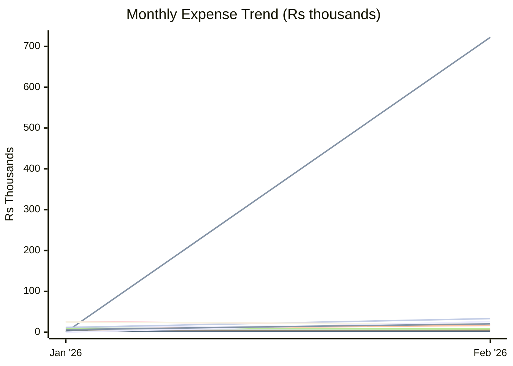
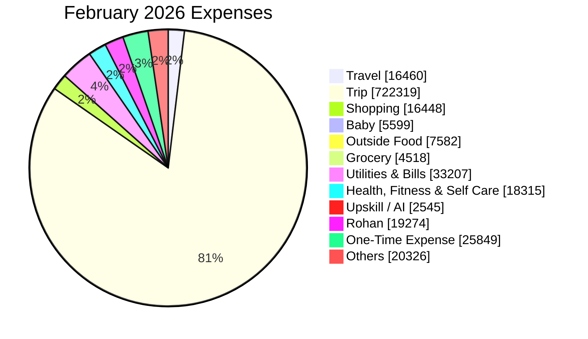

# Expense Report — February 2026

_Generated: 2026-08-02_

## Summary

| Category | February 2026 | Jan 2026 |
| --- | --- | --- |
| Travel | ₹16,460 | ₹12,213 |
| Trip | ₹722,319 | ₹0 |
| Shopping | ₹16,448 | ₹7,810 |
| Baby | ₹5,599 | ₹7,708 |
| Outside Food | ₹7,582 | ₹9,456 |
| Grocery | ₹4,518 | ₹2,539 |
| Utilities & Bills | ₹33,207 | ₹11,462 |
| Health, Fitness & Self Care | ₹18,315 | ₹25,510 |
| Upskill / AI | ₹2,545 | ₹2,570 |
| Rohan | ₹19,274 | ₹24,777 |
| One-Time Expense | ₹25,849 | ₹0 |
| Others | ₹20,326 | ₹6,308 |
| **Total** | **₹892,442** | **₹110,353** |

---

**Lines:** Travel · Trip · Shopping · Baby · Outside Food · Grocery · Utilities & Bills · Health, Fitness & Self Care · Upskill / AI · Rohan · One-Time Expense · Others

---

## Travel

| Date | Merchant | Card | Amount |
| ---- | -------- | ---- | ------:|
| Feb 04 | Fuel | ICICI Emeralde | ₹2,044 |
| Feb 04 | Parking | Paytm | ₹60 |
| Feb 05 | Fuel Surcharge ↩ Refund | ICICI Emeralde | (₹20) |
| Feb 05 | Fuel Surcharge (GST) ↩ Refund | ICICI Emeralde | (₹4) |
| Feb 10 | Fuel | ICICI Emeralde | ₹2,044 |
| Feb 11 | Fuel Surcharge ↩ Refund | ICICI Emeralde | (₹20) |
| Feb 11 | Fuel Surcharge (GST) ↩ Refund | ICICI Emeralde | (₹4) |
| Feb 11 | FastTag Recharge | Paytm | ₹1,500 |
| Feb 11 | Parking | Paytm | ₹120 |
| Feb 15 | Fuel | ICICI Emeralde | ₹2,044 |
| Feb 16 | Fuel Surcharge ↩ Refund | ICICI Emeralde | (₹20) |
| Feb 16 | Fuel Surcharge (GST) ↩ Refund | ICICI Emeralde | (₹4) |
| Feb 17 | Parking | Paytm | ₹60 |
| Feb 22 | Fuel | ICICI Emeralde | ₹1,111 |
| Feb 22 | Fuel | ICICI Emeralde | ₹2,044 |
| Feb 23 | Fuel Surcharge ↩ Refund | ICICI Emeralde | (₹11) |
| Feb 23 | Fuel Surcharge (GST) ↩ Refund | ICICI Emeralde | (₹2) |
| Feb 23 | Fuel Surcharge ↩ Refund | ICICI Emeralde | (₹20) |
| Feb 23 | Fuel Surcharge (GST) ↩ Refund | ICICI Emeralde | (₹4) |
| Feb 25 | Fuel | — | ₹2,044 |
| Feb 25 | Fuel Surcharge ↩ Refund | — | (₹20) |
| Feb 26 | FastTag Recharge | Paytm | ₹1,500 |
| Feb 28 | HP Petrol Pump | Paytm | ₹2,020 |
| | **Total** | | **₹16,460** |

## Trip

| Date | Merchant | Card | Amount |
| ---- | -------- | ---- | ------:|
| Feb 04 | Cleartrip Flight | — | ₹13,492 |
| Feb 04 | iShop | ICICI Emeralde | ₹37,470 |
| Feb 06 | Cleartrip Flight | — | ₹18,411 |
| Feb 06 | iShop | ICICI Emeralde | ₹67,324 |
| Feb 17 | Cleartrip Hotel | — | ₹88,476 |
| Feb 17 | Cleartrip Hotel | — | ₹54,025 |
| Feb 17 | Cleartrip Hotel | — | ₹113,751 |
| Feb 17 | MMT Hotel | — | ₹119,541 |
| Feb 20 | Visa Fee | Paytm | ₹19,840 |
| Feb 22 | OEBB | — | ₹6,416 |
| Feb 22 | OEBB | — | ₹21,619 |
| Feb 22 | OEBB | — | ₹11,631 |
| Feb 22 | Omio | ICICI Emeralde | ₹15,939 |
| Feb 23 | PolicyBazaar (Travel Insurance) | ICICI Emeralde | ₹6,672 |
| Feb 23 | Italo Treno | ICICI Emeralde | ₹8,171 |
| Feb 26 | MMT Hotel | — | ₹119,541 |
| | **Total** | | **₹722,319** |

## Shopping

| Date | Merchant | Card | Amount |
| ---- | -------- | ---- | ------:|
| Feb 01 | Myntra | — | ₹800 |
| Feb 03 | Myntra ↩ Refund | — | (₹153) |
| Feb 08 | Myntra ↩ Refund | — | (₹242) |
| Feb 08 | Pacific Mall | ICICI Emeralde | ₹338 |
| Feb 08 | Market 99 | ICICI Emeralde | ₹549 |
| Feb 08 | H&M | ICICI Emeralde | ₹3,398 |
| Feb 11 | Myntra | — | ₹1,403 |
| Feb 11 | Gyftr | — | ₹1,000 |
| Feb 11 | Nykaa | Paytm | ₹109 |
| Feb 15 | Krishan Kumar Dhamija | Paytm | ₹1,230 |
| Feb 15 | Surya Prakash Sharma | Paytm | ₹550 |
| Feb 18 | Myntra | — | ₹3,857 |
| Feb 18 | Myntra | — | ₹5,008 |
| Feb 19 | FA Gifts | — | ₹1,127 |
| Feb 19 | Myntra ↩ Refund | — | (₹3,834) |
| Feb 21 | New Fashioners | Paytm | ₹295 |
| Feb 28 | Manoj Chaudhari | Paytm | ₹403 |
| Feb 28 | Alok Color Lab | Paytm | ₹360 |
| Feb 28 | Sushma Devi | Paytm | ₹100 |
| Feb 28 | Sushma Devi | Paytm | ₹150 |
| | **Total** | | **₹16,448** |

## Baby

| Date | Merchant | Card | Amount |
| ---- | -------- | ---- | ------:|
| Feb 01 | Hopscotch | — | ₹4,953 |
| Feb 11 | FirstCry | ICICI Emeralde | ₹702 |
| Feb 12 | Hopscotch | — | ₹3,448 |
| Feb 12 | Hopscotch ↩ Refund | — | (₹1,228) |
| Feb 12 | Hopscotch ↩ Refund | — | (₹1,657) |
| Feb 12 | Hopscotch ↩ Refund | — | (₹921) |
| Feb 14 | FirstCry ↩ Refund | ICICI Emeralde | (₹648) |
| Feb 20 | Hopscotch ↩ Refund | — | (₹2,452) |
| Feb 20 | FirstCry | ICICI Emeralde | ₹2,870 |
| Feb 21 | FirstCry | ICICI Emeralde | ₹532 |
| | **Total** | | **₹5,599** |

## Outside Food

| Date | Merchant | Card | Amount |
| ---- | -------- | ---- | ------:|
| Feb 01 | Om Sweets | ICICI Emeralde | ₹239 |
| Feb 01 | Chaayos | ICICI Emeralde | ₹410 |
| Feb 01 | Chaayos | ICICI Emeralde | ₹945 |
| Feb 02 | Jasleen Kaur | Paytm | ₹180 |
| Feb 04 | Domino's | — | ₹470 |
| Feb 06 | Md Kaif | PhonePe | ₹110 |
| Feb 07 | Swiggy Cashback ↩ Refund | — | (₹446) |
| Feb 07 | Swiggy Cashback ↩ Refund | — | (₹223) |
| Feb 07 | Om Sweets | ICICI Emeralde | ₹197 |
| Feb 09 | Om Sweets | Paytm | ₹136 |
| Feb 09 | Om Sweets | Paytm | ₹273 |
| Feb 11 | Kashish Chhabra | Paytm | ₹188 |
| Feb 14 | Dhingra Bakery | Paytm | ₹500 |
| Feb 14 | Md Kaif | Paytm | ₹140 |
| Feb 15 | Swiggy | — | ₹193 |
| Feb 15 | Dhingra Bakery | Paytm | ₹730 |
| Feb 15 | Om Sweets | Paytm | ₹211 |
| Feb 19 | Kashish Chhabra | Paytm | ₹156 |
| Feb 20 | Swiggy | — | ₹527 |
| Feb 23 | Swiggy Cashback ↩ Refund | — | (₹564) |
| Feb 23 | Om Sweets | ICICI Emeralde | ₹410 |
| Feb 24 | Tim Tim Fresh | Paytm | ₹85 |
| Feb 24 | Tim Tim Fresh | Paytm | ₹120 |
| Feb 24 | Tim Tim Fresh | Paytm | ₹80 |
| Feb 25 | Tim Tim Fresh | Paytm | ₹30 |
| Feb 25 | Tim Tim Fresh | Paytm | ₹120 |
| Feb 25 | Tim Tim Fresh | Paytm | ₹120 |
| Feb 26 | Swiggy | — | ₹850 |
| Feb 26 | Swiggy | — | ₹853 |
| Feb 26 | Tim Tim Fresh | Paytm | ₹120 |
| Feb 27 | Swiggy | — | ₹290 |
| Feb 28 | Lingadurai S | Paytm | ₹130 |
| | **Total** | | **₹7,582** |

## Grocery

| Date | Merchant | Card | Amount |
| ---- | -------- | ---- | ------:|
| Feb 04 | Tim Tim Fresh | Paytm | ₹120 |
| Feb 06 | Shri Ram Paneer Bhandar | Paytm | ₹152 |
| Feb 06 | Md Firoz Alam | Paytm | ₹20 |
| Feb 07 | M S D P Saini | Paytm | ₹500 |
| Feb 08 | Reliance Retail | — | ₹1,061 |
| Feb 08 | Sethis Delicacy | Paytm | ₹230 |
| Feb 10 | Tim Tim Fresh | Paytm | ₹115 |
| Feb 10 | Tim Tim Fresh | Paytm | ₹95 |
| Feb 11 | Tim Tim Fresh | Paytm | ₹60 |
| Feb 11 | Tim Tim Fresh | Paytm | ₹80 |
| Feb 12 | Innovative Retail | — | ₹540 |
| Feb 12 | BigBasket | — | ₹276 |
| Feb 13 | Instamart | — | ₹235 |
| Feb 14 | Raj Kumar | Paytm | ₹30 |
| Feb 14 | Md Kalim (Sabzi) | Paytm | ₹245 |
| Feb 14 | Om Parkash | Paytm | ₹30 |
| Feb 14 | Manoj Kumar Ray (Sabzi) | Paytm | ₹30 |
| Feb 14 | MD Guljar | Paytm | ₹30 |
| Feb 14 | Santaj (Sabzi) | Paytm | ₹60 |
| Feb 14 | Mahender Saini | Paytm | ₹50 |
| Feb 14 | Joginder | Paytm | ₹30 |
| Feb 14 | Joginder | Paytm | ₹20 |
| Feb 14 | Rishabh Jain (Sabzi) | Paytm | ₹55 |
| Feb 17 | Tim Tim Fresh | Paytm | ₹125 |
| Feb 17 | Tim Tim Fresh | Paytm | ₹80 |
| Feb 17 | Tim Tim Fresh | Paytm | ₹80 |
| Feb 18 | Tim Tim Fresh | Paytm | ₹90 |
| Feb 21 | Raj Kumar | Paytm | ₹80 |
| | **Total** | | **₹4,518** |

## Utilities & Bills

| Date | Merchant | Card | Amount |
| ---- | -------- | ---- | ------:|
| Feb 08 | Vodafone Idea | — | ₹886 |
| Feb 11 | Airtel Mobile | Paytm | ₹1,533 |
| Feb 16 | Netflix | — | ₹499 |
| Feb 17 | Apple Services | Paytm | ₹5 |
| Feb 22 | Health Insurance EMI | — | ₹7,876 |
| Feb 22 | Health Insurance EMI | — | ₹991 |
| Feb 23 | ULB Haryana | Paytm | ₹3,024 |
| Feb 23 | ULB Haryana | Paytm | ₹1,743 |
| Feb 23 | DHBVN Electricity | Paytm | ₹16,650 |
| | **Total** | | **₹33,207** |

## Health, Fitness & Self Care

| Date | Merchant | Card | Amount |
| ---- | -------- | ---- | ------:|
| Feb 08 | Bhatia Medicos | Paytm | ₹40 |
| Feb 09 | Everyday Fitness | ICICI Emeralde | ₹18,000 |
| Feb 15 | Salon | Paytm | ₹100 |
| Feb 20 | Medical | Paytm | ₹175 |
| | **Total** | | **₹18,315** |

## Upskill / AI

| Date | Merchant | Card | Amount |
| ---- | -------- | ---- | ------:|
| Feb 26 | Cursor | — | ₹2,146 |
| Feb 28 | ChatGPT / OpenAI | — | ₹399 |
| | **Total** | | **₹2,545** |

## Rohan

| Date | Merchant | USD | Card | Amount |
| ---- | -------- | --- | ---- | ------:|
| Feb 02 | MORTON WILLIAMS - NA | $31.45 | — | ₹2,871 |
| Feb 05 | SQ *AMBO | $13.60 | — | ₹1,231 |
| Feb 06 | MTA*NYCT PAYGO | $3.00 | — | ₹271 |
| Feb 07 | MTA*NYCT PAYGO | $3.00 | — | ₹272 |
| Feb 13 | TST* THE KATI ROLL COM | $13.62 | — | ₹1,237 |
| Feb 13 | MORTON WILLIAMS - NA | $43.22 | — | ₹3,920 |
| Feb 14 | MTA*NYCT PAYGO | $3.00 | — | ₹272 |
| Feb 14 | MTA*NYCT PAYGO | $3.00 | — | ₹272 |
| Feb 16 | ROOSTERS COFFEEHOUSE | $6.82 | — | ₹619 |
| Feb 18 | SQ *AMBO | $13.60 | — | ₹1,233 |
| Feb 23 | Global Value Cash Back ↩ Refund | — | — | (₹266) |
| Feb 24 | LAO MA MA LA TANG. | $23.99 | — | ₹2,181 |
| Feb 26 | PATH TAPP PAYGO CP | $3.00 | — | ₹273 |
| Feb 26 | PATH TAPP PAYGO CP | $3.00 | — | ₹273 |
| Feb 27 | PATH TAPP PAYGO CP | $3.00 | — | ₹273 |
| Feb 27 | PATH TAPP PAYGO CP | $3.00 | — | ₹273 |
| Feb 27 | PATH TAPP PAYGO CP | $3.00 | — | ₹273 |
| Feb 27 | TST*ARTICHOKE BASILLES | $7.80 | — | ₹710 |
| Feb 28 | MORTON WILLIAMS - NA | $33.83 | — | ₹3,084 |
| | **Total** | | | **₹19,274** |

## One-Time Expense

| Date | Merchant | Card | Amount |
| ---- | -------- | ---- | ------:|
| Feb 03 | Baby Birthday Party | ICICI Emeralde | ₹5,000 |
| Feb 21 | Baby Birthday Party | ICICI Emeralde | ₹20,849 |
| | **Total** | | **₹25,849** |

## Others

| Date | Merchant | Card | Amount |
| ---- | -------- | ---- | ------:|
| Feb 03 | IGST | — | ₹10 |
| Feb 03 | Sachin | Paytm | ₹1,900 |
| Feb 06 | IGST | — | ₹4 |
| Feb 06 | Saurabh Kumar | PhonePe | ₹150 |
| Feb 07 | IGST | — | ₹1 |
| Feb 08 | IGST | — | ₹1 |
| Feb 08 | Pankaj | PhonePe | ₹250 |
| Feb 13 | IGST | — | ₹4 |
| Feb 14 | IGST | — | ₹14 |
| Feb 14 | Seraj | Paytm | ₹6,000 |
| Feb 14 | Navdeep | Paytm | ₹450 |
| Feb 15 | IGST | — | ₹1 |
| Feb 15 | IGST | — | ₹1 |
| Feb 15 | Sachin | Paytm | ₹7,600 |
| Feb 17 | IGST | — | ₹2 |
| Feb 17 | Kay Pee International | — | ₹300 |
| Feb 19 | IGST | — | ₹4 |
| Feb 22 | FCY Markup Fee | — | ₹533 |
| Feb 22 | IGST | — | ₹178 |
| Feb 23 | IGST | — | ₹23 |
| Feb 23 | IGST | — | ₹78 |
| Feb 23 | IGST | — | ₹42 |
| Feb 23 | Duli Mardi | Paytm | ₹2,500 |
| Feb 25 | Fresh N Up | Paytm | ₹258 |
| Feb 26 | IGST | — | ₹8 |
| Feb 27 | IGST | — | ₹1 |
| Feb 27 | IGST | — | ₹1 |
| Feb 27 | IGST | — | ₹8 |
| Feb 28 | IGST | — | ₹1 |
| Feb 28 | IGST | — | ₹1 |
| Feb 28 | IGST | — | ₹1 |
| | **Total** | | **₹20,326** |
