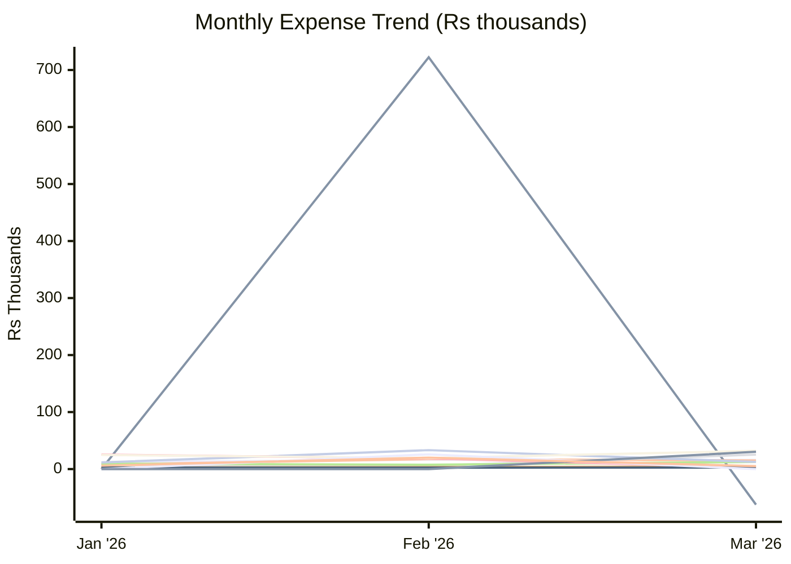
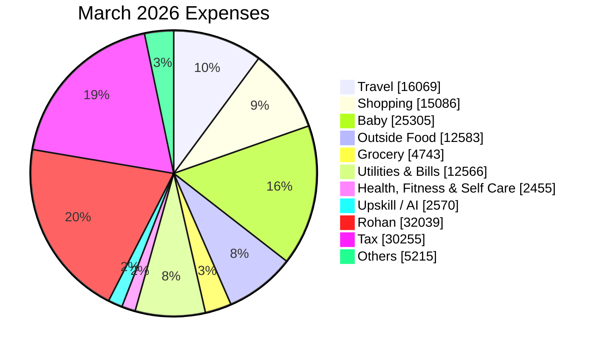

# Expense Report — March 2026

_Generated: 2026-08-02_

## Summary

| Category | March 2026 | Jan 2026 | Feb 2026 |
| --- | --- | --- | --- |
| Travel | ₹16,069 | ₹12,116 | ₹16,460 |
| Trip | (₹62,371) | ₹0 | ₹722,319 |
| Shopping | ₹15,086 | ₹7,810 | ₹17,509 |
| Baby | ₹25,305 | ₹7,708 | ₹5,599 |
| Outside Food | ₹12,583 | ₹9,456 | ₹7,582 |
| Grocery | ₹4,743 | ₹2,909 | ₹3,457 |
| Utilities & Bills | ₹12,566 | ₹11,462 | ₹33,207 |
| Health, Fitness & Self Care | ₹2,455 | ₹25,510 | ₹18,573 |
| Upskill / AI | ₹2,570 | ₹2,570 | ₹2,545 |
| Rohan | ₹32,039 | ₹24,777 | ₹19,274 |
| One-Time Expense | ₹0 | ₹0 | ₹25,849 |
| Tax | ₹30,255 | ₹0 | ₹0 |
| Others | ₹5,215 | ₹6,036 | ₹20,068 |
| **Total** | **₹96,515** | **₹110,353** | **₹892,442** |

---

**Lines:** Travel · Trip · Shopping · Baby · Outside Food · Grocery · Utilities & Bills · Health, Fitness & Self Care · Upskill / AI · Rohan · One-Time Expense · Tax · Others

---

## Travel

| Date | Merchant | Card | Amount |
| ---- | -------- | ---- | ------:|
| Mar 04 | Uber | — | ₹30 |
| Mar 04 | Uber | — | ₹99 |
| Mar 08 | Fuel | ICICI Emeralde | ₹3,640 |
| Mar 09 | Fuel Surcharge ↩ Refund | ICICI Emeralde | (₹36) |
| Mar 09 | Fuel Surcharge (GST) ↩ Refund | ICICI Emeralde | (₹7) |
| Mar 12 | Uber | — | ₹576 |
| Mar 12 | HP Petrol Pump | Paytm | ₹1,746 |
| Mar 17 | Parking | Paytm | ₹120 |
| Mar 18 | Parking | Paytm | ₹60 |
| Mar 19 | Fuel | ICICI Emeralde | ₹2,044 |
| Mar 19 | Parking | Paytm | ₹60 |
| Mar 20 | Fuel Surcharge ↩ Refund | ICICI Emeralde | (₹20) |
| Mar 20 | Fuel Surcharge (GST) ↩ Refund | ICICI Emeralde | (₹4) |
| Mar 22 | IGST (Fuel Surcharge) | — | ₹163 |
| Mar 24 | Fuel | ICICI Emeralde | ₹2,044 |
| Mar 25 | Fuel Surcharge ↩ Refund | ICICI Emeralde | (₹20) |
| Mar 25 | Fuel Surcharge (GST) ↩ Refund | ICICI Emeralde | (₹4) |
| Mar 26 | IGST (Fuel Surcharge) | — | ₹1 |
| Mar 26 | IGST (Fuel Surcharge) | — | ₹5 |
| Mar 27 | IGST (Fuel Surcharge) | — | ₹4 |
| Mar 28 | IGST (Fuel Surcharge) | — | ₹8 |
| Mar 28 | Fuel | ICICI Emeralde | ₹2,029 |
| Mar 28 | IDBI FASTag | Paytm | ₹1,500 |
| Mar 29 | IGST (Fuel Surcharge) | — | ₹10 |
| Mar 29 | Fuel Surcharge ↩ Refund | ICICI Emeralde | (₹20) |
| Mar 29 | Fuel Surcharge (GST) ↩ Refund | ICICI Emeralde | (₹4) |
| Mar 30 | IGST (Fuel Surcharge) | — | ₹1 |
| Mar 31 | Fuel | ICICI Emeralde | ₹2,044 |
| | **Total** | | **₹16,069** |

## Trip

| Date | Merchant | Card | Amount |
| ---- | -------- | ---- | ------:|
| Mar 02 | VFS Visa Fee | ICICI Emeralde | ₹22,857 |
| Mar 06 | Goibibo | — | ₹24,604 |
| Mar 06 | VakaTrip | — | ₹21,517 |
| Mar 08 | Gyftr (SmartBuy) | — | ₹5,500 |
| Mar 12 | Italo Treno ↩ Refund | ICICI Emeralde | (₹4,970) |
| Mar 21 | Gyftr (SmartBuy) | — | ₹10,413 |
| Mar 21 | Omio Berlin ↩ Refund | ICICI Emeralde | (₹10,801) |
| Mar 21 | Visa Agent Fee | Paytm | ₹14,000 |
| Mar 23 | SmartBuy Hotel ↩ Refund | — | (₹113,751) |
| Mar 23 | SmartBuy Hotel ↩ Refund | — | (₹88,476) |
| Mar 24 | MMT Hotel SmartBuy | — | ₹25,482 |
| Mar 24 | iShop | ICICI Emeralde | ₹30,598 |
| Mar 30 | Heritage Village Resort | — | ₹655 |
| | **Total** | | **(₹62,371)** |

## Shopping

| Date | Merchant | Card | Amount |
| ---- | -------- | ---- | ------:|
| Mar 05 | Gyftr | — | ₹7,020 |
| Mar 06 | Reliance Retail | — | ₹1,061 |
| Mar 08 | Lifestyle | Paytm | ₹96 |
| Mar 15 | Flipkart | — | ₹3,015 |
| Mar 19 | Kay Pee International | — | ₹328 |
| Mar 21 | Gyftr | — | ₹1,950 |
| Mar 21 | Nykaa | — | ₹566 |
| Mar 23 | Mr Pankaj | Paytm | ₹50 |
| Mar 24 | Gyftr | — | ₹1,000 |
| | **Total** | | **₹15,086** |

## Baby

| Date | Merchant | Card | Amount |
| ---- | -------- | ---- | ------:|
| Mar 12 | Kids Clinic (Cloudnine) | ICICI Emeralde | ₹202 |
| Mar 12 | Kids Clinic (Cloudnine) | ICICI Emeralde | ₹1,400 |
| Mar 13 | Kids Clinic (Cloudnine) | ICICI Emeralde | ₹148 |
| Mar 13 | Kids Clinic (Cloudnine) | ICICI Emeralde | ₹1,000 |
| Mar 13 | Kids Clinic (Cloudnine) | ICICI Emeralde | ₹523 |
| Mar 13 | Kids Clinic (Cloudnine) | ICICI Emeralde | ₹32 |
| Mar 24 | Kids Clinic (Cloudnine) | ICICI Emeralde | ₹22,000 |
| | **Total** | | **₹25,305** |

## Outside Food

| Date | Merchant | Card | Amount |
| ---- | -------- | ---- | ------:|
| Mar 01 | Baba Ji Restaurant | Paytm | ₹300 |
| Mar 01 | Om Sweets | Paytm | ₹250 |
| Mar 03 | Baba Ji Restaurant | Paytm | ₹120 |
| Mar 05 | Barbeque Nation | Paytm | ₹78 |
| Mar 07 | Om Sweets | Paytm | ₹208 |
| Mar 08 | Da Palermo Pizzeria | ICICI Emeralde | ₹977 |
| Mar 09 | Insta Restaurants | — | ₹4,515 |
| Mar 10 | Swiggy | — | ₹447 |
| Mar 10 | Swiggy | — | ₹406 |
| Mar 10 | Preet Restaurant | Paytm | ₹783 |
| Mar 10 | Tim Tim Fresh | Paytm | ₹260 |
| Mar 14 | Swiggy | — | ₹500 |
| Mar 17 | Om Sweets | — | ₹357 |
| Mar 17 | Domino's | Paytm | ₹427 |
| Mar 17 | Tim Tim Fresh | Paytm | ₹80 |
| Mar 18 | Tim Tim Fresh | Paytm | ₹100 |
| Mar 19 | Tim Tim Fresh | Paytm | ₹45 |
| Mar 20 | Om Sweets | Paytm | ₹104 |
| Mar 21 | Om Sweets | Paytm | ₹41 |
| Mar 21 | Om Sweets | Paytm | ₹277 |
| Mar 22 | Swiggy | — | ₹141 |
| Mar 22 | McDonald's | Paytm | ₹213 |
| Mar 23 | Fresh N Up | Paytm | ₹175 |
| Mar 25 | Swiggy | — | ₹500 |
| Mar 25 | Swiggy | — | ₹643 |
| Mar 31 | ILD Trade Centre | — | ₹465 |
| Mar 31 | Tim Tim Fresh | Paytm | ₹70 |
| Mar 31 | Tim Tim Fresh | Paytm | ₹100 |
| | **Total** | | **₹12,583** |

## Grocery

| Date | Merchant | Card | Amount |
| ---- | -------- | ---- | ------:|
| Mar 01 | Innovative Retail | — | ₹899 |
| Mar 01 | Krishan Kumar Dhamija | Paytm | ₹100 |
| Mar 01 | Kusma | Paytm | ₹50 |
| Mar 01 | Siraju Din | Paytm | ₹20 |
| Mar 01 | Chirag | Paytm | ₹50 |
| Mar 03 | Shri Ram Paneer | Paytm | ₹302 |
| Mar 07 | Innovative Retail | — | ₹1,055 |
| Mar 07 | Shri Ram Paneer | Paytm | ₹2 |
| Mar 07 | M S D P Saini | Paytm | ₹1,025 |
| Mar 20 | Ashok Kumar | Paytm | ₹60 |
| Mar 21 | Shri Ram Paneer | Paytm | ₹25 |
| Mar 23 | Sethis Delicacy | Paytm | ₹25 |
| Mar 23 | Sethis Delicacy | Paytm | ₹425 |
| Mar 24 | Innovative Retail | — | ₹55 |
| Mar 24 | M S D P Saini | — | ₹525 |
| Mar 26 | Kprs Enterprises | Paytm | ₹125 |
| | **Total** | | **₹4,743** |

## Utilities & Bills

| Date | Merchant | Card | Amount |
| ---- | -------- | ---- | ------:|
| Mar 06 | Vodafone Idea | — | ₹886 |
| Mar 13 | Jio Mobile | Paytm | ₹899 |
| Mar 16 | Netflix | — | ₹499 |
| Mar 18 | Airtel | — | ₹1,415 |
| Mar 22 | Health Insurance EMI | — | ₹7,961 |
| Mar 22 | Health Insurance EMI | — | ₹906 |
| | **Total** | | **₹12,566** |

## Health, Fitness & Self Care

| Date | Merchant | Card | Amount |
| ---- | -------- | ---- | ------:|
| Mar 14 | Bhatia Medicos | Paytm | ₹340 |
| Mar 15 | Bhatia Medicos | Paytm | ₹175 |
| Mar 15 | Dr Lal Pathlabs | Paytm | ₹180 |
| Mar 16 | Dr Lal Pathlabs | Paytm | ₹890 |
| Mar 27 | Salon | Paytm | ₹870 |
| | **Total** | | **₹2,455** |

## Upskill / AI

| Date | Merchant | Card | Amount |
| ---- | -------- | ---- | ------:|
| Mar 07 | Claude | — | ₹2,171 |
| Mar 28 | ChatGPT / OpenAI | — | ₹399 |
| | **Total** | | **₹2,570** |

## Rohan

| Date | Merchant | USD | Card | Amount |
| ---- | -------- | --- | ---- | ------:|
| Mar 01 | MTA*NYCT PAYGO | $3.00 | — | ₹273 |
| Mar 01 | MTA*PATH SMARTCARD/SRT | $120.75 | — | ₹11,006 |
| Mar 01 | MTA*NYCT PAYGO | $3.00 | — | ₹273 |
| Mar 01 | MTA*NYCT PAYGO | $3.00 | — | ₹273 |
| Mar 04 | PATH TAPP PAYGO CP | $3.00 | — | ₹277 |
| Mar 05 | MTA*NYCT PAYGO | $3.00 | — | ₹276 |
| Mar 05 | MTA*NYCT PAYGO | $3.00 | — | ₹276 |
| Mar 07 | MTA*NYCT PAYGO | $3.00 | — | ₹276 |
| Mar 07 | MTA*NYCT PAYGO | $3.00 | — | ₹276 |
| Mar 07 | DUANE READE #14436 | $7.72 | — | ₹710 |
| Mar 09 | SQ *MATTO NYU | $2.65 | — | ₹244 |
| Mar 10 | TST* FRESH & CO - 729 | $16.28 | — | ₹1,501 |
| Mar 11 | MTA*NYCT PAYGO | $3.00 | — | ₹276 |
| Mar 12 | MTA*NYCT PAYGO | $3.00 | — | ₹278 |
| Mar 12 | MTA*NYCT PAYGO | $8.75 | — | ₹810 |
| Mar 12 | 4252 DOS TOROS JFK | $16.29 | — | ₹1,507 |
| Mar 19 | MTA*NYCT PAYGO | $8.75 | — | ₹813 |
| Mar 19 | MORTON WILLIAMS - NA | $15.18 | — | ₹1,417 |
| Mar 23 | Global Value Cash Back ↩ Refund | — | — | (₹936) |
| Mar 24 | MTA*NYCT PAYGO | $3.00 | — | ₹282 |
| Mar 25 | SQ *AMBO | $13.60 | — | ₹1,277 |
| Mar 26 | POTBELLY #581 | $12.29 | — | ₹1,153 |
| Mar 27 | TST*MASALA TIMES GREEN | $22.86 | — | ₹2,168 |
| Mar 28 | MORTON WILLIAMS - NA | $30.55 | — | ₹2,897 |
| Mar 30 | MTA*NYCT PAYGO | $3.00 | — | ₹284 |
| Mar 30 | MTA*NYCT PAYGO | $3.00 | — | ₹284 |
| Mar 30 | THELEWALA | $11.00 | — | ₹1,043 |
| Mar 30 | LITTLE ITALY PIZZA | $10.28 | — | ₹972 |
| Mar 31 | PATH TAPP PAYGO CP | $3.00 | — | ₹284 |
| Mar 31 | PATH TAPP PAYGO CP | $3.00 | — | ₹282 |
| Mar 31 | SQ *AMBO | $13.60 | — | ₹1,286 |
| | **Total** | | | **₹32,039** |

## Tax

| Date | Merchant | Card | Amount |
| ---- | -------- | ---- | ------:|
| Mar 21 | Income Tax (CBDT) | — | ₹30,255 |
| | **Total** | | **₹30,255** |

## Others

| Date | Merchant | Card | Amount |
| ---- | -------- | ---- | ------:|
| Mar 01 | IGST | — | ₹3 |
| Mar 01 | IGST | — | ₹11 |
| Mar 01 | Sanjay Chhabra | Paytm | ₹26 |
| Mar 02 | DCC Transaction Fee | — | ₹4 |
| Mar 02 | IGST | — | ₹1 |
| Mar 02 | IGST | — | ₹1 |
| Mar 02 | IGST | — | ₹1 |
| Mar 02 | IGST | — | ₹40 |
| Mar 02 | IGST | — | ₹1 |
| Mar 05 | IGST | — | ₹1 |
| Mar 07 | IGST | — | ₹1 |
| Mar 07 | IGST | — | ₹1 |
| Mar 07 | IGST | — | ₹8 |
| Mar 08 | IGST | — | ₹1 |
| Mar 08 | IGST | — | ₹1 |
| Mar 08 | IGST | — | ₹3 |
| Mar 08 | IGST | — | ₹77 |
| Mar 08 | Avs Communication | Paytm | ₹20 |
| Mar 08 | Avs Communication | Paytm | ₹40 |
| Mar 10 | IGST | — | ₹1 |
| Mar 11 | IGST | — | ₹5 |
| Mar 12 | IGST | — | ₹1 |
| Mar 12 | Divyam Goel | Paytm | ₹2,330 |
| Mar 12 | Madan Gopal | Paytm | ₹110 |
| Mar 12 | Unknown | PhonePe | ₹35 |
| Mar 13 | IGST | — | ₹1 |
| Mar 14 | IGST | — | ₹3 |
| Mar 14 | IGST | — | ₹5 |
| Mar 20 | IGST | — | ₹3 |
| Mar 20 | IGST | — | ₹5 |
| Mar 22 | FCY Markup Fee | — | ₹1,872 |
| Mar 28 | Nimesh Gurung | Paytm | ₹400 |
| Mar 29 | Poojan Bhitrikotey | Paytm | ₹200 |
| Mar 30 | DCC Fee | — | ₹4 |
| | **Total** | | **₹5,215** |
