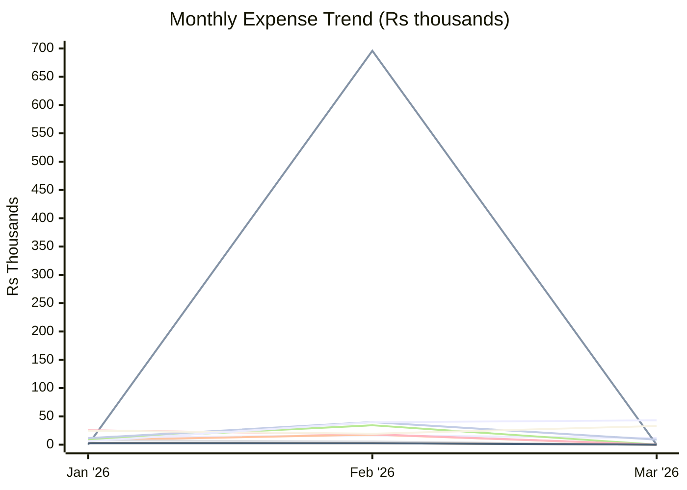
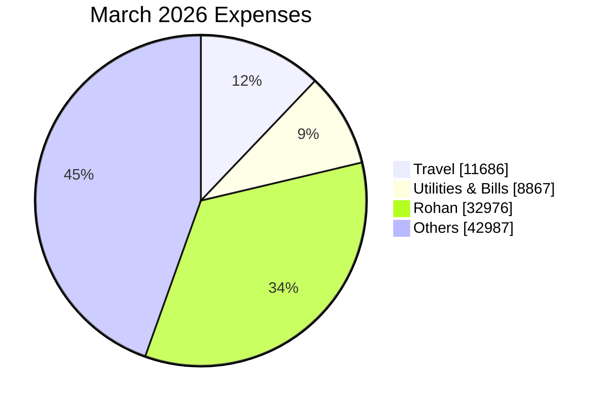

# Expense Report — March 2026

_Generated: 2026-08-02_

## Summary

| Category | March 2026 | Jan 2026 | Feb 2026 |
| --- | --- | --- | --- |
| Travel | ₹11,686 | ₹12,116 | ₹16,460 |
| Trip | ₹0 | ₹0 | ₹695,807 |
| Shopping | ₹0 | ₹7,810 | ₹17,809 |
| Baby | ₹0 | ₹7,708 | ₹5,599 |
| Outside Food | ₹0 | ₹9,456 | ₹34,276 |
| Grocery | ₹0 | ₹2,909 | ₹2,612 |
| Utilities & Bills | ₹8,867 | ₹11,462 | ₹39,879 |
| Health, Fitness & Self Care | ₹0 | ₹25,510 | ₹18,358 |
| Upskill / AI | ₹0 | ₹2,570 | ₹2,545 |
| Rohan | ₹32,976 | ₹24,777 | ₹19,274 |
| Others | ₹42,987 | ₹6,036 | ₹39,608 |
| **Total** | **₹96,515** | **₹110,353** | **₹892,227** |

---

**Lines:** Travel · Trip · Shopping · Baby · Outside Food · Grocery · Utilities & Bills · Health, Fitness & Self Care · Upskill / AI · Rohan · Others

---

## Travel

| Date | Merchant | Card | Amount |
| ---- | -------- | ---- | ------:|
| Mar 08 | Fuel | ICICI Emeralde | ₹3,640 |
| Mar 09 | Fuel Surcharge ↩ Refund | ICICI Emeralde | (₹36) |
| Mar 09 | Fuel Surcharge (GST) ↩ Refund | ICICI Emeralde | (₹7) |
| Mar 19 | Fuel | ICICI Emeralde | ₹2,044 |
| Mar 20 | Fuel Surcharge ↩ Refund | ICICI Emeralde | (₹20) |
| Mar 20 | Fuel Surcharge (GST) ↩ Refund | ICICI Emeralde | (₹4) |
| Mar 24 | Fuel | ICICI Emeralde | ₹2,044 |
| Mar 25 | Fuel Surcharge ↩ Refund | ICICI Emeralde | (₹20) |
| Mar 25 | Fuel Surcharge (GST) ↩ Refund | ICICI Emeralde | (₹4) |
| Mar 28 | Fuel | ICICI Emeralde | ₹2,029 |
| Mar 29 | Fuel Surcharge ↩ Refund | ICICI Emeralde | (₹20) |
| Mar 29 | Fuel Surcharge (GST) ↩ Refund | ICICI Emeralde | (₹4) |
| Mar 31 | Fuel | ICICI Emeralde | ₹2,044 |
| | **Total** | | **₹11,686** |

## Utilities & Bills

| Date | Merchant | Card | Amount |
| ---- | -------- | ---- | ------:|
| Mar 22 | Health Insurance EMI | — | ₹7,961 |
| Mar 22 | Health Insurance EMI | — | ₹906 |
| | **Total** | | **₹8,867** |

## Rohan

| Date | Merchant | USD | Card | Amount |
| ---- | -------- | --- | ---- | ------:|
| Mar 01 | MTA*NYCT PAYGO | $3.00 | — | ₹273 |
| Mar 01 | MTA*PATH SMARTCARD/SRT | $120.75 | — | ₹11,006 |
| Mar 01 | MTA*NYCT PAYGO | $3.00 | — | ₹273 |
| Mar 01 | MTA*NYCT PAYGO | $3.00 | — | ₹273 |
| Mar 04 | PATH TAPP PAYGO CP | $3.00 | — | ₹277 |
| Mar 05 | MTA*NYCT PAYGO | $3.00 | — | ₹276 |
| Mar 05 | MTA*NYCT PAYGO | $3.00 | — | ₹276 |
| Mar 07 | MTA*NYCT PAYGO | $3.00 | — | ₹276 |
| Mar 07 | MTA*NYCT PAYGO | $3.00 | — | ₹276 |
| Mar 07 | DUANE READE #14436 | $7.72 | — | ₹710 |
| Mar 09 | SQ *MATTO NYU | $2.65 | — | ₹244 |
| Mar 10 | TST* FRESH & CO - 729 | $16.28 | — | ₹1,501 |
| Mar 11 | MTA*NYCT PAYGO | $3.00 | — | ₹276 |
| Mar 12 | MTA*NYCT PAYGO | $3.00 | — | ₹278 |
| Mar 12 | MTA*NYCT PAYGO | $8.75 | — | ₹810 |
| Mar 12 | 4252 DOS TOROS JFK | $16.29 | — | ₹1,507 |
| Mar 19 | MTA*NYCT PAYGO | $8.75 | — | ₹813 |
| Mar 19 | MORTON WILLIAMS - NA | $15.18 | — | ₹1,417 |
| Mar 24 | MTA*NYCT PAYGO | $3.00 | — | ₹282 |
| Mar 25 | SQ *AMBO | $13.60 | — | ₹1,277 |
| Mar 26 | POTBELLY #581 | $12.29 | — | ₹1,153 |
| Mar 27 | TST*MASALA TIMES GREEN | $22.86 | — | ₹2,168 |
| Mar 28 | MORTON WILLIAMS - NA | $30.55 | — | ₹2,897 |
| Mar 30 | MTA*NYCT PAYGO | $3.00 | — | ₹284 |
| Mar 30 | MTA*NYCT PAYGO | $3.00 | — | ₹284 |
| Mar 30 | THELEWALA | $11.00 | — | ₹1,043 |
| Mar 30 | LITTLE ITALY PIZZA | $10.28 | — | ₹972 |
| Mar 31 | PATH TAPP PAYGO CP | $3.00 | — | ₹284 |
| Mar 31 | PATH TAPP PAYGO CP | $3.00 | — | ₹282 |
| Mar 31 | SQ *AMBO | $13.60 | — | ₹1,286 |
| | **Total** | | | **₹32,976** |

## Others

| Date | Merchant | Card | Amount |
| ---- | -------- | ---- | ------:|
| Mar 01 | IGST | — | ₹3 |
| Mar 01 | IGST | — | ₹11 |
| Mar 01 | INNOVATIVE RETAIL CON | — | ₹899 |
| Mar 01 | Baba Ji Restaurant | Paytm | ₹300 |
| Mar 01 | Mr KRISHAN KUMAR DHAMIJA | Paytm | ₹100 |
| Mar 01 | Sanjay Chhabra | Paytm | ₹26 |
| Mar 01 | Kusma | Paytm | ₹50 |
| Mar 01 | Siraju Din | Paytm | ₹20 |
| Mar 01 | CHIRAG | Paytm | ₹50 |
| Mar 01 | Om Sweets Pvt Ltd | Paytm | ₹250 |
| Mar 02 | 1% on all DCC Transaction | — | ₹4 |
| Mar 02 | IGST | — | ₹1 |
| Mar 02 | IGST | — | ₹1 |
| Mar 02 | IGST | — | ₹1 |
| Mar 02 | IGST | — | ₹40 |
| Mar 02 | IGST | — | ₹1 |
| Mar 02 | DS VISA FEE VFS | ICICI Emeralde | ₹22,857 |
| Mar 03 | Shri Ram Paneer Bhandar | Paytm | ₹302 |
| Mar 03 | M S Baba Ji Restaurant | Paytm | ₹120 |
| Mar 04 | PTM*UBER INDIA SYSTEM | — | ₹30 |
| Mar 04 | UBER INDIA SYSTE PVT | — | ₹99 |
| Mar 05 | IGST | — | ₹1 |
| Mar 05 | GYFTR VIA SMARTBUY | — | ₹7,020 |
| Mar 05 | Barbeque Nation | Paytm | ₹78 |
| Mar 06 | PAY*VODAFONEIDEA LIMI | — | ₹886 |
| Mar 06 | PPSL*Reliance Retail L | — | ₹1,061 |
| Mar 06 | ING*GOIBIBO | — | ₹24,604 |
| Mar 06 | VAKATRIP.COM | — | ₹21,517 |
| Mar 07 | IGST | — | ₹1 |
| Mar 07 | IGST | — | ₹1 |
| Mar 07 | IGST | — | ₹8 |
| Mar 07 | INNOVATIVE RETAIL CON | — | ₹1,055 |
| Mar 07 | CLAUDE.AI SUBSCRIPTION | — | ₹2,171 |
| Mar 07 | Shri Ram Paneer Bhandar | Paytm | ₹2 |
| Mar 07 | M s d p Saini Florist And Bakers | Paytm | ₹1,025 |
| Mar 07 | Om Sweets Pvt Ltd | Paytm | ₹208 |
| Mar 08 | IGST | — | ₹1 |
| Mar 08 | IGST | — | ₹1 |
| Mar 08 | IGST | — | ₹3 |
| Mar 08 | IGST | — | ₹77 |
| Mar 08 | GYFTR VIA SMARTBUY | — | ₹5,500 |
| Mar 08 | DA PALERMO PIZZERIA | ICICI Emeralde | ₹977 |
| Mar 08 | Life Style International Pvt Ltd | Paytm | ₹96 |
| Mar 08 | Avs Communication | Paytm | ₹20 |
| Mar 08 | Avs Communication | Paytm | ₹40 |
| Mar 09 | INSTA RESTAURANTS PRIV | — | ₹4,515 |
| Mar 10 | PYU*Swiggy Food | — | ₹447 |
| Mar 10 | PYU*Swiggy Food | — | ₹406 |
| Mar 10 | IGST | — | ₹1 |
| Mar 10 | Preet Restaurant | Paytm | ₹783 |
| Mar 10 | Tim Tim Fresh | Paytm | ₹260 |
| Mar 11 | IGST | — | ₹5 |
| Mar 12 | IGST | — | ₹1 |
| Mar 12 | UBER INDIA SYSTE PVT | — | ₹576 |
| Mar 12 | KIDS CLINIC INDIA LIMI | ICICI Emeralde | ₹202 |
| Mar 12 | KIDS CLINIC INDIA LIMI | ICICI Emeralde | ₹1,400 |
| Mar 12 | ITALOTRENO ROMA ↩ Refund | ICICI Emeralde | (₹4,970) |
| Mar 12 | HP Service Center | Paytm | ₹1,746 |
| Mar 12 | Divyam Goel | Paytm | ₹2,330 |
| Mar 12 | Madan Gopal | Paytm | ₹110 |
| Mar 12 | ******1942 | PhonePe | ₹35 |
| Mar 13 | IGST | — | ₹1 |
| Mar 13 | KIDS CLINIC INDIA LIMI | ICICI Emeralde | ₹148 |
| Mar 13 | KIDS CLINIC INDIA LIMI | ICICI Emeralde | ₹1,000 |
| Mar 13 | KIDS CLINIC INDIA LIMI | ICICI Emeralde | ₹523 |
| Mar 13 | KIDS CLINIC INDIA LIMI | ICICI Emeralde | ₹32 |
| Mar 13 | Jio Mobile | Paytm | ₹899 |
| Mar 14 | Swiggy | — | ₹500 |
| Mar 14 | IGST | — | ₹3 |
| Mar 14 | IGST | — | ₹5 |
| Mar 14 | Bhatia Medicos | Paytm | ₹340 |
| Mar 15 | PYU*Flipkart | — | ₹3,015 |
| Mar 15 | Bhatia Medicos | Paytm | ₹175 |
| Mar 15 | Dr Lal Pathlabs Kiosk | Paytm | ₹180 |
| Mar 16 | NETFLIX | — | ₹499 |
| Mar 16 | Dr Lal Pathlabs Kiosk | Paytm | ₹890 |
| Mar 17 | OM SWEETS PVT LTD | — | ₹357 |
| Mar 17 | Dominos Pizza | Paytm | ₹427 |
| Mar 17 | Kuldeep Pal | Paytm | ₹120 |
| Mar 17 | Tim Tim Fresh | Paytm | ₹80 |
| Mar 18 | BHARTI AIRTEL LTD | — | ₹1,415 |
| Mar 18 | Kuldeep Pal | Paytm | ₹60 |
| Mar 18 | Tim Tim Fresh | Paytm | ₹100 |
| Mar 19 | Kay Pee International | — | ₹328 |
| Mar 19 | Kuldeep Pal | Paytm | ₹60 |
| Mar 19 | Tim Tim Fresh | Paytm | ₹45 |
| Mar 20 | IGST | — | ₹3 |
| Mar 20 | IGST | — | ₹5 |
| Mar 20 | Ashok kumar | Paytm | ₹60 |
| Mar 20 | Om Sweets Pvt Ltd | Paytm | ₹104 |
| Mar 21 | GYFTR VIA SMARTBUY | — | ₹1,950 |
| Mar 21 | GYFTR VIA SMARTBUY | — | ₹10,413 |
| Mar 21 | PYU*Nykaa E-Retail Pri | — | ₹566 |
| Mar 21 | CBDT | — | ₹30,255 |
| Mar 21 | OMIO BERLIN ↩ Refund | ICICI Emeralde | (₹10,801) |
| Mar 21 | Shri Ram Paneer Bhandar | Paytm | ₹25 |
| Mar 21 | Shakuntala Devi | Paytm | ₹14,000 |
| Mar 21 | Om Sweets Pvt Ltd | Paytm | ₹41 |
| Mar 21 | Om Sweets Pvt Ltd | Paytm | ₹277 |
| Mar 22 | PYU*Swiggy Food | — | ₹141 |
| Mar 22 | CONSOLIDATED FCY MARKUP FEE | — | ₹1,872 |
| Mar 22 | IGST | — | ₹163 |
| Mar 22 | Mcdonalds | Paytm | ₹213 |
| Mar 23 | Global Value Cash Back ↩ Refund | — | (₹936) |
| Mar 23 | CT HOTEL VIA SMARTBUY ↩ Refund | — | (₹113,751) |
| Mar 23 | CT HOTEL VIA SMARTBUY ↩ Refund | — | (₹88,476) |
| Mar 23 | Fresh N Up | Paytm | ₹175 |
| Mar 23 | Sethis delicacy | Paytm | ₹25 |
| Mar 23 | Sethis delicacy | Paytm | ₹425 |
| Mar 23 | Mr Pankaj | Paytm | ₹50 |
| Mar 24 | INNOVATIVE RETAIL CON | — | ₹55 |
| Mar 24 | GYFTR VIA SMARTBUY | — | ₹1,000 |
| Mar 24 | MMT HOTEL VIA SMARTBU | — | ₹25,482 |
| Mar 24 | M S D P SAINI FLORIST | — | ₹525 |
| Mar 24 | I SHOP | ICICI Emeralde | ₹30,598 |
| Mar 24 | KIDS CLINIC INDIA LIMI | ICICI Emeralde | ₹22,000 |
| Mar 25 | PYU*Swiggy Food | — | ₹500 |
| Mar 25 | PYU*Swiggy Food | — | ₹643 |
| Mar 26 | IGST | — | ₹1 |
| Mar 26 | IGST | — | ₹5 |
| Mar 26 | Kprs Enterprises | Paytm | ₹125 |
| Mar 27 | IGST | — | ₹4 |
| Mar 27 | Vijay Thakur | Paytm | ₹870 |
| Mar 28 | OPENAI *CHATGPT SUBSCR | — | ₹399 |
| Mar 28 | IGST | — | ₹8 |
| Mar 28 | Nimesh Gurung | Paytm | ₹400 |
| Mar 28 | IDBI Bank FASTag | Paytm | ₹1,500 |
| Mar 29 | IGST | — | ₹10 |
| Mar 29 | Poojan Bhitrikotey | Paytm | ₹200 |
| Mar 30 | DCC Transaction | — | ₹4 |
| Mar 30 | HERITAGE VILLAGE RESORT | — | ₹655 |
| Mar 30 | IGST | — | ₹1 |
| Mar 31 | P764 PH ILD TRADE CENTR | — | ₹465 |
| Mar 31 | Tim Tim Fresh | Paytm | ₹70 |
| Mar 31 | Tim Tim Fresh | Paytm | ₹100 |
| | **Total** | | **₹42,987** |
