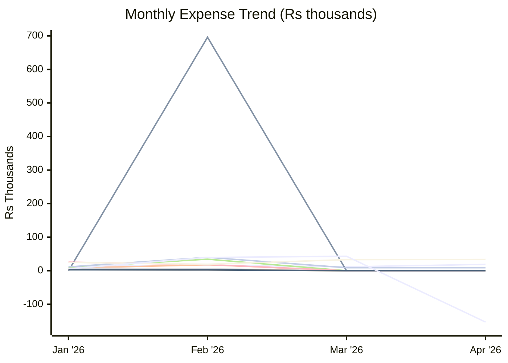
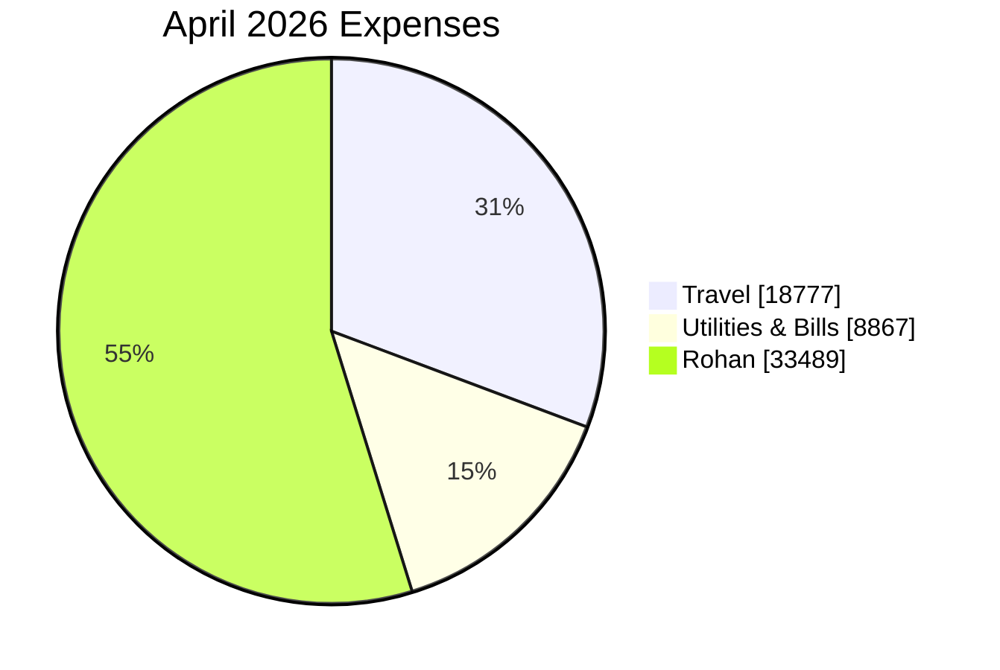

# Expense Report — April 2026

_Generated: 2026-08-02_

## Summary

| Category | April 2026 | Feb 2026 | Mar 2026 |
| --- | --- | --- | --- |
| Travel | ₹18,777 | ₹16,460 | ₹11,686 |
| Trip | ₹0 | ₹695,807 | ₹0 |
| Shopping | ₹0 | ₹17,809 | ₹0 |
| Baby | ₹0 | ₹5,599 | ₹0 |
| Outside Food | ₹0 | ₹34,276 | ₹0 |
| Grocery | ₹0 | ₹2,612 | ₹0 |
| Utilities & Bills | ₹8,867 | ₹39,879 | ₹8,867 |
| Health, Fitness & Self Care | ₹0 | ₹18,358 | ₹0 |
| Upskill / AI | ₹0 | ₹2,545 | ₹0 |
| Rohan | ₹33,489 | ₹19,274 | ₹32,976 |
| Others | (₹153,041) | ₹39,608 | ₹42,987 |
| **Total** | **(₹91,907)** | **₹892,227** | **₹96,515** |

---

**Lines:** Travel · Trip · Shopping · Baby · Outside Food · Grocery · Utilities & Bills · Health, Fitness & Self Care · Upskill / AI · Rohan · Others

---

## Travel

| Date | Merchant | Card | Amount |
| ---- | -------- | ---- | ------:|
| Apr 01 | Fuel Surcharge ↩ Refund | ICICI Emeralde | (₹20) |
| Apr 01 | Fuel Surcharge (GST) ↩ Refund | ICICI Emeralde | (₹4) |
| Apr 02 | Fuel | ICICI Emeralde | ₹2,044 |
| Apr 03 | Fuel Surcharge ↩ Refund | ICICI Emeralde | (₹20) |
| Apr 03 | Fuel Surcharge (GST) ↩ Refund | ICICI Emeralde | (₹4) |
| Apr 04 | Fuel | ICICI Emeralde | ₹2,044 |
| Apr 05 | Fuel Surcharge ↩ Refund | ICICI Emeralde | (₹20) |
| Apr 05 | Fuel Surcharge (GST) ↩ Refund | ICICI Emeralde | (₹4) |
| Apr 07 | Fuel | ICICI Emeralde | ₹2,044 |
| Apr 08 | Fuel Surcharge ↩ Refund | ICICI Emeralde | (₹20) |
| Apr 08 | Fuel Surcharge (GST) ↩ Refund | ICICI Emeralde | (₹4) |
| Apr 14 | Fuel | ICICI Emeralde | ₹3,474 |
| Apr 16 | Fuel Surcharge ↩ Refund | ICICI Emeralde | (₹34) |
| Apr 16 | Fuel Surcharge (GST) ↩ Refund | ICICI Emeralde | (₹6) |
| Apr 19 | Fuel | ICICI Emeralde | ₹3,769 |
| Apr 20 | Fuel Surcharge ↩ Refund | ICICI Emeralde | (₹37) |
| Apr 20 | Fuel Surcharge (GST) ↩ Refund | ICICI Emeralde | (₹7) |
| Apr 23 | Fuel | ICICI Emeralde | ₹1,538 |
| Apr 24 | Fuel Surcharge ↩ Refund | ICICI Emeralde | (₹15) |
| Apr 24 | Fuel Surcharge (GST) ↩ Refund | ICICI Emeralde | (₹3) |
| Apr 29 | Fuel | ICICI Emeralde | ₹2,044 |
| Apr 30 | Fuel Surcharge ↩ Refund | ICICI Emeralde | (₹20) |
| Apr 30 | Fuel Surcharge (GST) ↩ Refund | ICICI Emeralde | (₹4) |
| Apr 30 | Fuel | ICICI Emeralde | ₹2,044 |
| | **Total** | | **₹18,777** |

## Utilities & Bills

| Date | Merchant | Card | Amount |
| ---- | -------- | ---- | ------:|
| Apr 22 | Health Insurance EMI | — | ₹8,047 |
| Apr 22 | Health Insurance EMI | — | ₹820 |
| | **Total** | | **₹8,867** |

## Rohan

| Date | Merchant | USD | Card | Amount |
| ---- | -------- | --- | ---- | ------:|
| Apr 01 | PATH TAPP PAYGO CP | $3.00 | — | ₹282 |
| Apr 01 | PATH TAPP PAYGO CP | $3.00 | — | ₹280 |
| Apr 01 | SQ *AMBO | $14.14 | — | ₹1,329 |
| Apr 01 | SQ *KOLKATA CHAI CAFE | $14.15 | — | ₹1,330 |
| Apr 03 | PATH TAPP PAYGO CP | $3.00 | — | ₹278 |
| Apr 03 | PATH TAPP PAYGO CP | $3.00 | — | ₹278 |
| Apr 04 | MTA*NYCT PAYGO | $3.00 | — | ₹278 |
| Apr 04 | PATH TAPP PAYGO CP | $3.00 | — | ₹278 |
| Apr 06 | PATH TAPP PAYGO CP | $3.00 | — | ₹278 |
| Apr 06 | PATH TAPP PAYGO CP | $3.00 | — | ₹280 |
| Apr 07 | PATH TAPP PAYGO CP | $3.00 | — | ₹280 |
| Apr 09 | PATH TAPP PAYGO CP | $3.00 | — | ₹277 |
| Apr 10 | PATH TAPP PAYGO CP | $3.00 | — | ₹277 |
| Apr 10 | PATH TAPP PAYGO CP | $3.00 | — | ₹279 |
| Apr 10 | NYAUTOSHOW JACOBJAVITS | $44.00 | — | ₹4,067 |
| Apr 11 | PATH TAPP PAYGO CP | $3.00 | — | ₹279 |
| Apr 11 | TACO MAHAL | $9.20 | — | ₹856 |
| Apr 13 | SQ *AMBO | $14.14 | — | ₹1,316 |
| Apr 13 | PATH TAPP PAYGO CP | $3.00 | — | ₹279 |
| Apr 14 | PATH TAPP PAYGO CP | $3.00 | — | ₹280 |
| Apr 15 | PATH TAPP PAYGO CP | $3.00 | — | ₹280 |
| Apr 16 | TST* THE KATI ROLL COM | $7.55 | — | ₹705 |
| Apr 16 | TST*PASTASOLE CHELSEA | $14.06 | — | ₹1,308 |
| Apr 17 | PATH TAPP PAYGO CP | $3.00 | — | ₹279 |
| Apr 20 | MTA*PATH SMARTCARD/SRT | $120.75 | — | ₹11,187 |
| Apr 23 | TST* FRESH & CO - 729 | $15.79 | — | ₹1,479 |
| Apr 28 | TACO MAHAL | $17.42 | — | ₹1,643 |
| Apr 29 | MORTON WILLIAMS - NA | $37.14 | — | ₹3,524 |
| | **Total** | | | **₹33,489** |

## Others

| Date | Merchant | Card | Amount |
| ---- | -------- | ---- | ------:|
| Apr 01 | IGST | — | ₹1 |
| Apr 01 | IGST | — | ₹4 |
| Apr 01 | IGST | — | ₹4 |
| Apr 01 | IGST | — | ₹1 |
| Apr 01 | IGST | — | ₹1 |
| Apr 01 | IGST | — | ₹1 |
| Apr 01 | IGST | — | ₹5 |
| Apr 01 | FIRSTCRY | ICICI Emeralde | ₹961 |
| Apr 01 | Kuldeep Pal | Paytm | ₹60 |
| Apr 01 | Tim Tim Fresh | Paytm | ₹110 |
| Apr 02 | CAS*Swiggy | — | ₹18,754 |
| Apr 02 | IGST | — | ₹1 |
| Apr 02 | IGST | — | ₹1 |
| Apr 02 | IGST | — | ₹5 |
| Apr 02 | IGST | — | ₹5 |
| Apr 02 | IDBI Bank FASTag | Paytm | ₹1,500 |
| Apr 02 | Ghamroj Toll Plaza | Paytm | ₹162 |
| Apr 02 | Kuldeep Pal | Paytm | ₹180 |
| Apr 02 | Dlf Cyber City Devel | Paytm | ₹60 |
| Apr 03 | EIKO PATISSERIE AND BA | — | ₹398 |
| Apr 03 | Venus Desires5 | ICICI Emeralde | ₹1,575 |
| Apr 03 | FIRSTCRY | ICICI Emeralde | ₹742 |
| Apr 03 | OM SWEETS PVT LTD | ICICI Emeralde | ₹326 |
| Apr 04 | Global Value Membership | — | ₹199 |
| Apr 04 | WWW SWIGGY IN | — | ₹483 |
| Apr 04 | IGST | — | ₹36 |
| Apr 04 | IGST | — | ₹1 |
| Apr 04 | IGST | — | ₹1 |
| Apr 04 | Burma Burma Restauran | ICICI Emeralde | ₹1,744 |
| Apr 04 | UNIQLO INDIA PRIVATE | ICICI Emeralde | ₹3,980 |
| Apr 04 | HENNES N MAURITZ | ICICI Emeralde | ₹2,598 |
| Apr 04 | DLF Mall of India parking | Paytm | ₹80 |
| Apr 05 | PHARMEASY VIA SMARTBU | — | ₹1,109 |
| Apr 05 | IGST | — | ₹1 |
| Apr 05 | IGST | — | ₹1 |
| Apr 06 | ZOMATO LTD | — | ₹668 |
| Apr 07 | IGST | — | ₹1 |
| Apr 07 | IGST | — | ₹1 |
| Apr 07 | I SHOP ↩ Refund | ICICI Emeralde | (₹37,470) |
| Apr 07 | I SHOP ↩ Refund | ICICI Emeralde | (₹64,526) |
| Apr 07 | Tim Tim Fresh | Paytm | ₹95 |
| Apr 07 | Tim Tim Fresh | Paytm | ₹80 |
| Apr 08 | National Highways A | — | ₹3,103 |
| Apr 08 | IGST | — | ₹1 |
| Apr 08 | VEDRA HOSPITALITY LLP | ICICI Emeralde | ₹389 |
| Apr 08 | Tim Tim Fresh | Paytm | ₹25 |
| Apr 08 | Kuldeep Pal | Paytm | ₹60 |
| Apr 08 | Tim Tim Fresh | Paytm | ₹150 |
| Apr 09 | BPPY CC PAYMENT ↩ Refund | — | (₹12,610) |
| Apr 09 | BHARTI AIRTEL LTD | — | ₹1,415 |
| Apr 09 | PAY*VODAFONEIDEA LIMI | — | ₹886 |
| Apr 09 | RELIANCE RETAIL LIMITED | — | ₹1,061 |
| Apr 10 | IGST | — | ₹1 |
| Apr 10 | Aditya Kumar | Paytm | ₹400 |
| Apr 10 | Fresh N Up | Paytm | ₹240 |
| Apr 10 | Dakshin Haryana Bijli Vitran Nigam Limited | Paytm | ₹225 |
| Apr 10 | Suraj Yadav | Paytm | ₹103 |
| Apr 10 | Swiggy | Paytm | ₹942 |
| Apr 11 | PAY*WWW YESMADAM COM | — | ₹3,292 |
| Apr 11 | PAY*WWW YESMADAM COM | — | ₹1,428 |
| Apr 11 | PAY*WWW YESMADAM COM | — | ₹1,178 |
| Apr 11 | PAY*WWW YESMADAM COM ↩ Refund | — | (₹2,998) |
| Apr 11 | BPPY CC PAYMENT ↩ Refund | — | (₹69,912) |
| Apr 11 | IGST | — | ₹1 |
| Apr 11 | IGST | — | ₹1 |
| Apr 11 | IGST | — | ₹15 |
| Apr 11 | Pos4 | Paytm | ₹2,020 |
| Apr 11 | BBNOW | PhonePe | ₹102 |
| Apr 11 | BBNOW | PhonePe | ₹212 |
| Apr 12 | WWW SWIGGY IN | — | ₹742 |
| Apr 12 | PYU*Swiggy Food | — | ₹656 |
| Apr 12 | M S D P SAINI FLORIST | — | ₹1,900 |
| Apr 12 | IGST | — | ₹1 |
| Apr 12 | S Sons | Paytm | ₹380 |
| Apr 12 | Ranjeet Kumar | Paytm | ₹40 |
| Apr 12 | Sachin Kumar | Paytm | ₹630 |
| Apr 12 | Sharma Gift House | Paytm | ₹900 |
| Apr 12 | Meesho | Paytm | ₹519 |
| Apr 13 | M S JIANA ADVENTURES L | — | ₹4,968 |
| Apr 13 | CT HOTEL VIA SMARTBUY ↩ Refund | — | (₹54,025) |
| Apr 13 | IGST | — | ₹3 |
| Apr 13 | Westside | ICICI Emeralde | ₹799 |
| Apr 13 | HENNES N MAURITZ | ICICI Emeralde | ₹2,498 |
| Apr 14 | IGST | — | ₹5 |
| Apr 14 | Bhatia Medicos | Paytm | ₹320 |
| Apr 14 | Tim Tim Fresh | Paytm | ₹80 |
| Apr 14 | Tim Tim Fresh | Paytm | ₹100 |
| Apr 15 | IGST | — | ₹1 |
| Apr 15 | IGST | — | ₹1 |
| Apr 15 | Tim Tim Fresh | Paytm | ₹370 |
| Apr 16 | NETFLIX | — | ₹499 |
| Apr 16 | IGST | — | ₹1 |
| Apr 16 | IGST | — | ₹3 |
| Apr 16 | Rajan | Paytm | ₹25 |
| Apr 16 | M S Baba Ji Restaurant | Paytm | ₹150 |
| Apr 17 | DHBVN | — | ₹9,419 |
| Apr 17 | AMAZON PAY INDIA PRIVA | — | ₹1,653 |
| Apr 18 | IGST | — | ₹1 |
| Apr 18 | IGST | — | ₹5 |
| Apr 18 | Blue Tokai Coffee Roasters | Paytm | ₹1,386 |
| Apr 19 | PYU*ZOMATO | — | ₹707 |
| Apr 19 | GYFTR VIA SMARTBUY | — | ₹3,750 |
| Apr 19 | LIFE STYLE INTERNATIO FARIDABAD IN | ICICI Emeralde | ₹1,299 |
| Apr 19 | LIFE STYLE INTERNATIO FARIDABAD IN | ICICI Emeralde | ₹996 |
| Apr 19 | Shri Ram Paneer Bhandar | Paytm | ₹248 |
| Apr 19 | Life Style International Pvt Ltd | Paytm | ₹152 |
| Apr 19 | Seema Devi | Paytm | ₹35 |
| Apr 19 | Bigbasket | Paytm | ₹335 |
| Apr 19 | Innovative Retail Concept | Paytm | ₹228 |
| Apr 19 | Innovative Retail Concepts Private Limited | Paytm | ₹540 |
| Apr 21 | PYU*Swiggy Food | — | ₹354 |
| Apr 21 | MCDONALDS | — | ₹47 |
| Apr 21 | MCDONALDS | — | ₹280 |
| Apr 21 | RAZ*Swiggy | — | ₹540 |
| Apr 21 | IGST | — | ₹40 |
| Apr 21 | Kuldeep Pal | Paytm | ₹180 |
| Apr 22 | CONSOLIDATED FCY MARKUP FEE ↩ Refund | — | (₹12) |
| Apr 22 | IGST | — | ₹148 |
| Apr 22 | Muhavra Enterprises Pr FARIDABAD IN | ICICI Emeralde | ₹1,080 |
| Apr 22 | SAI COMMUNICATION | PhonePe | ₹350 |
| Apr 23 | Swiggy ↩ Refund | — | (₹35) |
| Apr 23 | Global Value_Cash Back ↩ Refund | — | (₹391) |
| Apr 23 | CT FLIGHT VIA SMARTBUY ↩ Refund | — | (₹18,411) |
| Apr 23 | IGST | — | ₹5 |
| Apr 23 | OM SWEETS PVT LTD FARIDABAD IN | ICICI Emeralde | ₹2,930 |
| Apr 24 | INNOVATIVE RETAIL | — | ₹275 |
| Apr 24 | REWARD 360 GLOBAL SERV BANGALORE IN | ICICI Emeralde | ₹1,000 |
| Apr 24 | FIRSTCRY PUNE IN | ICICI Emeralde | ₹677 |
| Apr 26 | DA PALERMO PIZZERIA FARIDABAD IN | ICICI Emeralde | ₹515 |
| Apr 26 | Muhavra Enterprises Pr FARIDABAD IN | ICICI Emeralde | ₹1,649 |
| Apr 26 | OM SWEETS PVT LTD FARIDABAD IN | ICICI Emeralde | ₹147 |
| Apr 26 | OM SWEETS PVT LTD FARIDABAD IN | ICICI Emeralde | ₹208 |
| Apr 26 | Pos4 | Paytm | ₹1,020 |
| Apr 26 | Mr Kuldeep | Paytm | ₹477 |
| Apr 27 | Shri Ram Paneer Bhandar | PhonePe | ₹110 |
| Apr 28 | OPENAI *CHATGPT SUBSCR | — | ₹399 |
| Apr 28 | 5485 YOUMEE DLF SAKET DELHI IN | ICICI Emeralde | ₹1,143 |
| Apr 28 | Aydi Restaurants India Pr SOUTH DELHI IN | ICICI Emeralde | ₹998 |
| Apr 28 | UNIQLO INDIA PVT LTD NEW DELHI IN | ICICI Emeralde | ₹1,980 |
| Apr 28 | SI BANG HOSPITALITY A NEW DELHI IN | ICICI Emeralde | ₹190 |
| Apr 28 | Dlf Avenue Saket | Paytm | ₹120 |
| Apr 28 | BHATIA MEDICOS | PhonePe | ₹90 |
| Apr 29 | Tim Tim Fresh | Paytm | ₹265 |
| Apr 29 | Bigbasket | Paytm | ₹219 |
| Apr 30 | 1% on all DCC Transaction ↩ Refund | — | (₹4) |
| Apr 30 | Kay Pee International | — | ₹230 |
| Apr 30 | IGST | — | ₹6 |
| Apr 30 | IGST | — | ₹13 |
| Apr 30 | IGST | — | ₹1 |
| Apr 30 | Kuldeep Pal | Paytm | ₹120 |
| Apr 30 | Tim Tim Fresh | Paytm | ₹20 |
| | **Total** | | **(₹153,041)** |
