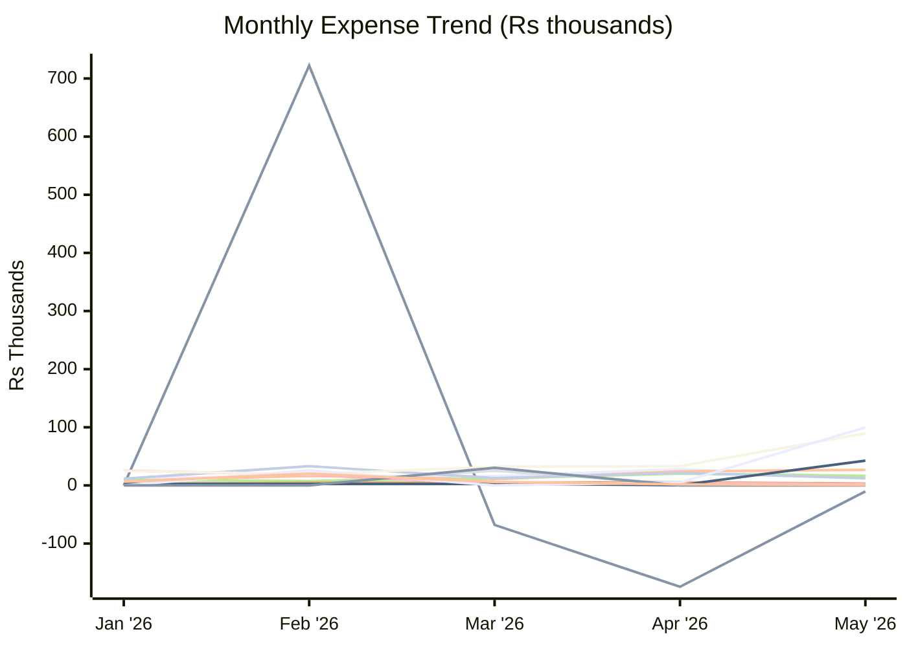
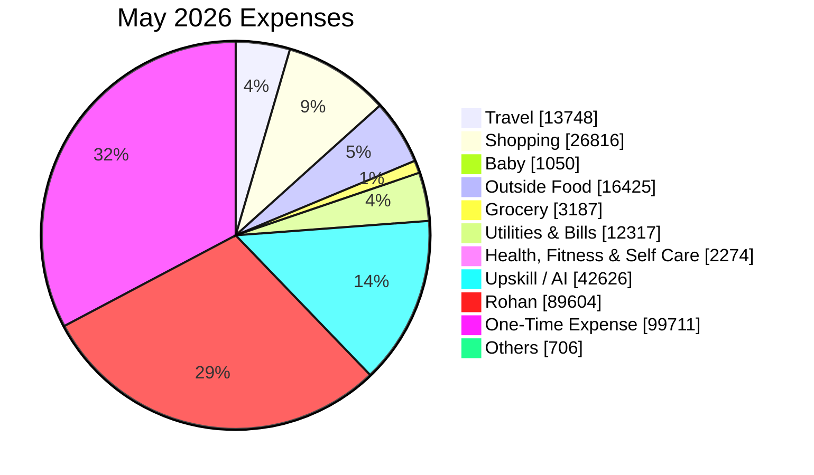

# Expense Report — May 2026

_Generated: 2026-08-02_

## Summary

| Category | May 2026 | Mar 2026 | Apr 2026 |
| --- | --- | --- | --- |
| Travel | ₹13,748 | ₹15,877 | ₹27,860 |
| Trip | (₹10,229) | (₹67,871) | (₹174,432) |
| Shopping | ₹26,816 | ₹10,616 | ₹24,220 |
| Baby | ₹1,050 | ₹25,305 | ₹2,380 |
| Outside Food | ₹16,425 | ₹12,117 | ₹20,172 |
| Grocery | ₹3,187 | ₹4,743 | ₹5,279 |
| Utilities & Bills | ₹12,317 | ₹12,566 | ₹21,661 |
| Health, Fitness & Self Care | ₹2,274 | ₹2,455 | ₹4,419 |
| Upskill / AI | ₹42,626 | ₹2,570 | ₹399 |
| Rohan | ₹89,604 | ₹32,039 | ₹33,099 |
| One-Time Expense | ₹99,711 | ₹0 | ₹4,968 |
| Tax | ₹0 | ₹30,255 | ₹0 |
| Others | ₹706 | ₹5,872 | ₹1,836 |
| **Total** | **₹298,235** | **₹86,545** | **(₹28,139)** |

---

**Lines:** Travel · Trip · Shopping · Baby · Outside Food · Grocery · Utilities & Bills · Health, Fitness & Self Care · Upskill / AI · Rohan · One-Time Expense · Tax · Others

---

## Travel

| Date | Merchant | Card | Amount |
| ---- | -------- | ---- | ------:|
| May 01 | Fuel Surcharge ↩ Refund | ICICI Emeralde | (₹20) |
| May 01 | Fuel Surcharge (GST) ↩ Refund | ICICI Emeralde | (₹4) |
| May 05 | Fuel | ICICI Emeralde | ₹3,793 |
| May 06 | Fuel Surcharge ↩ Refund | ICICI Emeralde | (₹38) |
| May 06 | Fuel Surcharge (GST) ↩ Refund | ICICI Emeralde | (₹7) |
| May 09 | IDBI FASTag | Paytm | ₹100 |
| May 12 | FASTag Recharge | Paytm | ₹200 |
| May 12 | Porter | PhonePe | ₹186 |
| May 14 | Petrol Pump (ILD) | — | ₹456 |
| May 14 | Fuel | ICICI Emeralde | ₹2,044 |
| May 15 | Fuel Surcharge ↩ Refund | ICICI Emeralde | (₹20) |
| May 15 | Fuel Surcharge (GST) ↩ Refund | ICICI Emeralde | (₹4) |
| May 19 | Fuel | ICICI Emeralde | ₹1,539 |
| May 19 | Parking | Paytm | ₹60 |
| May 19 | FASTag Recharge | Paytm | ₹200 |
| May 20 | Fuel Surcharge ↩ Refund | ICICI Emeralde | (₹15) |
| May 20 | Fuel Surcharge (GST) ↩ Refund | ICICI Emeralde | (₹3) |
| May 20 | Fuel | ICICI Emeralde | ₹2,044 |
| May 21 | Fuel Surcharge ↩ Refund | ICICI Emeralde | (₹20) |
| May 21 | Fuel Surcharge (GST) ↩ Refund | ICICI Emeralde | (₹4) |
| May 21 | Parking | Paytm | ₹120 |
| May 26 | Fuel | ICICI Emeralde | ₹3,056 |
| May 26 | Parking | Paytm | ₹60 |
| May 27 | Fuel Surcharge ↩ Refund | ICICI Emeralde | (₹30) |
| May 27 | Fuel Surcharge (GST) ↩ Refund | ICICI Emeralde | (₹5) |
| May 28 | Parking | Paytm | ₹60 |
| | **Total** | | **₹13,748** |

## Trip

| Date | Merchant | Card | Amount |
| ---- | -------- | ---- | ------:|
| May 07 | Cleartrip Flight (SmartBuy) ↩ Refund | — | (₹13,492) |
| May 08 | Divyam Goel (Trip) | Paytm | ₹3,263 |
| | **Total** | | **(₹10,229)** |

## Shopping

| Date | Merchant | Card | Amount |
| ---- | -------- | ---- | ------:|
| May 02 | Aditya Birla Lifestyle | — | ₹929 |
| May 02 | Trent | — | ₹449 |
| May 06 | Gyftr | — | ₹3,000 |
| May 06 | Myntra | — | ₹3,095 |
| May 07 | Myntra | ICICI Emeralde | ₹1,274 |
| May 07 | Rahul Ahirwar | Paytm | ₹150 |
| May 08 | Myntra ↩ Refund | — | (₹799) |
| May 09 | Myntra | — | ₹817 |
| May 12 | Myntra ↩ Refund | — | (₹1,574) |
| May 13 | Myntra ↩ Refund | — | (₹699) |
| May 16 | Amit Gupta | Paytm | ₹600 |
| May 16 | Rajouri Garden | Paytm | ₹1,600 |
| May 16 | Zoe By Bani | Paytm | ₹4,500 |
| May 16 | Rajouri Garden | Paytm | ₹7,999 |
| May 16 | Rajouri Garden | Paytm | ₹4,500 |
| May 17 | Nykaa | — | ₹326 |
| May 17 | Nykaa ↩ Refund | — | (₹18) |
| May 23 | Amazon | — | ₹667 |
| | **Total** | | **₹26,816** |

## Baby

| Date | Merchant | Card | Amount |
| ---- | -------- | ---- | ------:|
| May 06 | FirstCry | — | ₹1,050 |
| | **Total** | | **₹1,050** |

## Outside Food

| Date | Merchant | Card | Amount |
| ---- | -------- | ---- | ------:|
| May 01 | Om Sweets | — | ₹1,218 |
| May 02 | Swiggy | — | ₹490 |
| May 02 | Swiggy | — | ₹395 |
| May 04 | Swiggy ↩ Refund | — | (₹88) |
| May 05 | McDonald's | — | ₹226 |
| May 05 | Tim Tim Fresh | Paytm | ₹120 |
| May 06 | Om Sweets | ICICI Emeralde | ₹410 |
| May 06 | Blue Tokai | ICICI Emeralde | ₹672 |
| May 06 | Zomato | Paytm | ₹707 |
| May 08 | Swiggy | — | ₹607 |
| May 10 | Saengmyeong Namu | ICICI Emeralde | ₹260 |
| May 10 | Saengmyeong Namu | ICICI Emeralde | ₹450 |
| May 11 | Swiggy | — | ₹238 |
| May 11 | Fresh N Up | Paytm | ₹310 |
| May 12 | Pearl Foods | ICICI Emeralde | ₹200 |
| May 12 | Vedra Hospitality | ICICI Emeralde | ₹426 |
| May 14 | Tim Tim Fresh | Paytm | ₹160 |
| May 14 | Tim Tim Fresh | Paytm | ₹225 |
| May 15 | Swiggy | — | ₹610 |
| May 15 | Baba Ji Restaurant | Paytm | ₹50 |
| May 16 | Om Sweets | — | ₹400 |
| May 16 | Om Sweets | ICICI Emeralde | ₹133 |
| May 16 | Prince Chaat | Paytm | ₹130 |
| May 17 | Swiggy | — | ₹355 |
| May 18 | Swiggy ↩ Refund | — | (₹61) |
| May 19 | Swiggy ↩ Refund | — | (₹36) |
| May 19 | Tim Tim Fresh | Paytm | ₹110 |
| May 19 | Tim Tim Fresh | Paytm | ₹100 |
| May 20 | Cafe Parmesan | — | ₹1,538 |
| May 20 | Tim Tim Fresh | Paytm | ₹210 |
| May 21 | Tim Tim Fresh | Paytm | ₹60 |
| May 21 | Tim Tim Fresh | Paytm | ₹160 |
| May 22 | Swiggy | — | ₹349 |
| May 23 | Cafe Parmesan | — | ₹1,670 |
| May 23 | Zomato | Paytm | ₹600 |
| May 24 | Swiggy | — | ₹501 |
| May 25 | Swiggy ↩ Refund | — | (₹35) |
| May 25 | McDonald's | Paytm | ₹86 |
| May 26 | Swiggy ↩ Refund | — | (₹50) |
| May 26 | Zomato | — | ₹663 |
| May 26 | Tim Tim Fresh | Paytm | ₹100 |
| May 26 | Tim Tim Fresh | Paytm | ₹60 |
| May 26 | Tim Tim Fresh | Paytm | ₹100 |
| May 28 | Tim Tim Fresh | Paytm | ₹100 |
| May 29 | Swiggy | — | ₹354 |
| May 31 | Om Sweets | ICICI Emeralde | ₹273 |
| May 31 | Tawama Grills | Paytm | ₹869 |
| | **Total** | | **₹16,425** |

## Grocery

| Date | Merchant | Card | Amount |
| ---- | -------- | ---- | ------:|
| May 03 | Metro | ICICI Emeralde | ₹1,690 |
| May 03 | Shri Ram Paneer Bhandar | Paytm | ₹276 |
| May 10 | Reliance Retail | — | ₹1,061 |
| May 16 | Farmud Khan | Paytm | ₹160 |
| | **Total** | | **₹3,187** |

## Utilities & Bills

| Date | Merchant | Card | Amount |
| ---- | -------- | ---- | ------:|
| May 10 | Airtel | — | ₹1,415 |
| May 10 | Vodafone Idea | — | ₹886 |
| May 16 | Netflix | — | ₹499 |
| May 22 | Health Insurance EMI | — | ₹8,135 |
| May 22 | Health Insurance EMI | — | ₹732 |
| May 30 | Cinepolis | Paytm | ₹290 |
| May 30 | Cinepolis | Paytm | ₹360 |
| | **Total** | | **₹12,317** |

## Health, Fitness & Self Care

| Date | Merchant | Card | Amount |
| ---- | -------- | ---- | ------:|
| May 03 | Salon | Paytm | ₹100 |
| May 11 | House of Diagnostics | — | ₹1,999 |
| May 17 | Bhatia Medicos | Paytm | ₹90 |
| May 24 | Bhatia Medicos | Paytm | ₹85 |
| | **Total** | | **₹2,274** |

## Upskill / AI

| Date | Merchant | Card | Amount |
| ---- | -------- | ---- | ------:|
| May 10 | ChatGPT / OpenAI | — | ₹1,116 |
| May 18 | Anthropic | — | ₹2,267 |
| May 20 | Claude | — | ₹2,280 |
| May 21 | Anthropic | — | ₹2,288 |
| May 22 | IGST (Anthropic) | — | ₹8 |
| May 24 | Aseem Rastogi | Paytm | ₹31,999 |
| May 28 | ChatGPT / OpenAI | — | ₹399 |
| May 29 | Anthropic | — | ₹2,259 |
| May 29 | IGST (Anthropic) | — | ₹8 |
| May 30 | IGST | — | ₹1 |
| | **Total** | | **₹42,626** |

## Rohan

| Date | Merchant | USD | Card | Amount |
| ---- | -------- | --- | ---- | ------:|
| May 02 | MORTON WILLIAMS | $37.33 | — | ₹3,543 |
| May 06 | MORTON WILLIAMS | $10.47 | — | ₹991 |
| May 19 | MORTON WILLIAMS | $25.47 | — | ₹2,461 |
| May 23 | Global Value Cash Back ↩ Refund | — | — | (₹216) |
| May 31 | GoIbibo Flight (Rohan) | — | — | ₹79,744 |
| May 31 | TARGET T-1886 | $32.41 | — | ₹3,081 |
| | **Total** | | | **₹89,604** |

## One-Time Expense

| Date | Merchant | Card | Amount |
| ---- | -------- | ---- | ------:|
| May 02 | Laptop | ICICI Emeralde | ₹99,711 |
| | **Total** | | **₹99,711** |

## Others

| Date | Merchant | Card | Amount |
| ---- | -------- | ---- | ------:|
| May 03 | IGST | — | ₹13 |
| May 07 | IGST | — | ₹4 |
| May 11 | IGST | — | ₹4 |
| May 15 | Amarjeet | Paytm | ₹60 |
| May 19 | IGST | — | ₹8 |
| May 20 | IGST | — | ₹9 |
| May 20 | IGST | — | ₹8 |
| May 22 | FCY Markup Fee | — | ₹432 |
| May 22 | IGST | — | ₹132 |
| May 25 | Haseen Abbas | Paytm | ₹30 |
| May 30 | DCC Fee | — | ₹7 |
| | **Total** | | **₹706** |
