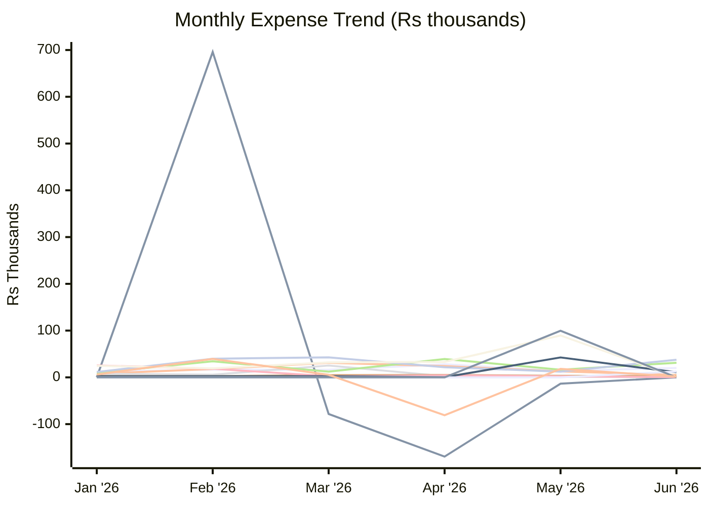
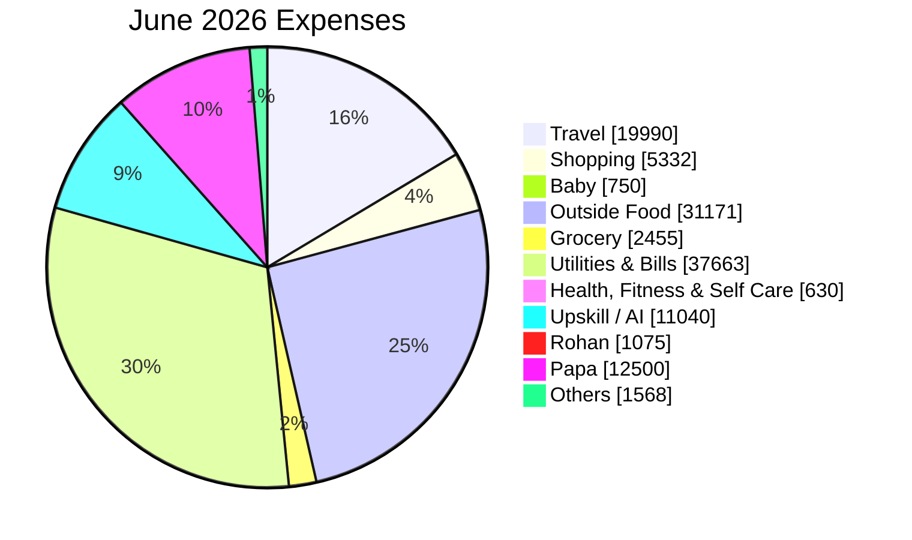

# Expense Report — June 2026

_Generated: 2026-08-02_

## Summary

| Category | June 2026 | Apr 2026 | May 2026 |
| --- | --- | --- | --- |
| Travel | ₹19,990 | ₹27,920 | ₹13,748 |
| Trip | ₹0 | (₹169,464) | (₹13,492) |
| Shopping | ₹5,332 | ₹24,160 | ₹12,717 |
| Baby | ₹750 | ₹2,380 | ₹1,050 |
| Outside Food | ₹31,171 | ₹39,156 | ₹16,425 |
| Grocery | ₹2,455 | ₹5,279 | ₹3,187 |
| Utilities & Bills | ₹37,663 | ₹21,661 | ₹12,317 |
| Health, Fitness & Self Care | ₹630 | ₹4,419 | ₹2,274 |
| Upskill / AI | ₹11,040 | ₹399 | ₹42,608 |
| Rohan | ₹1,075 | ₹33,099 | ₹89,604 |
| Papa | ₹12,500 | ₹0 | ₹0 |
| One-Time Expense | ₹0 | ₹0 | ₹99,711 |
| Others | ₹1,568 | (₹80,916) | ₹18,086 |
| **Total** | **₹124,173** | **(₹91,907)** | **₹298,235** |

---

**Lines:** Travel · Trip · Shopping · Baby · Outside Food · Grocery · Utilities & Bills · Health, Fitness & Self Care · Upskill / AI · Rohan · Papa · One-Time Expense · Others

---

## Travel

| Date | Merchant | Card | Amount |
| ---- | -------- | ---- | ------:|
| Jun 01 | Multitech Motors | — | ₹5,626 |
| Jun 02 | Fuel | ICICI Emeralde | ₹3,056 |
| Jun 02 | FASTag Recharge | Paytm | ₹200 |
| Jun 02 | Parking | Paytm | ₹60 |
| Jun 03 | Fuel Surcharge ↩ Refund | ICICI Emeralde | (₹30) |
| Jun 03 | Fuel Surcharge (GST) ↩ Refund | ICICI Emeralde | (₹5) |
| Jun 08 | FASTag Recharge | Paytm | ₹300 |
| Jun 09 | Fuel | ICICI Emeralde | ₹4,067 |
| Jun 09 | Parking | Paytm | ₹60 |
| Jun 10 | Fuel Surcharge ↩ Refund | ICICI Emeralde | (₹40) |
| Jun 10 | Fuel Surcharge (GST) ↩ Refund | ICICI Emeralde | (₹7) |
| Jun 10 | Parking | Paytm | ₹60 |
| Jun 11 | Gurgaon Faridabad Toll | Paytm | ₹40 |
| Jun 11 | FASTag Recharge | Paytm | ₹300 |
| Jun 11 | Parking | Paytm | ₹60 |
| Jun 16 | Parking | Paytm | ₹60 |
| Jun 17 | RK Fill Fly (Fuel) | ICICI Emeralde | ₹2,044 |
| Jun 17 | Parking | Paytm | ₹60 |
| Jun 18 | Fuel Surcharge ↩ Refund | ICICI Emeralde | (₹20) |
| Jun 18 | Fuel Surcharge (GST) ↩ Refund | ICICI Emeralde | (₹4) |
| Jun 18 | Fuel | Paytm | ₹2,020 |
| Jun 25 | Fuel | — | ₹2,044 |
| Jun 25 | Fuel Surcharge ↩ Refund | — | (₹20) |
| Jun 30 | Parking | Paytm | ₹60 |
| | **Total** | | **₹19,990** |

## Shopping

| Date | Merchant | Card | Amount |
| ---- | -------- | ---- | ------:|
| Jun 03 | Reliance Retail | — | ₹1,061 |
| Jun 07 | Gyftr | — | ₹3,000 |
| Jun 07 | Lifestyle | ICICI Emeralde | ₹193 |
| Jun 07 | Urvashi Garg | Paytm | ₹70 |
| Jun 19 | Amazon | — | ₹1,008 |
| | **Total** | | **₹5,332** |

## Baby

| Date | Merchant | Card | Amount |
| ---- | -------- | ---- | ------:|
| Jun 01 | Kids Clinic (Cloudnine) | ICICI Emeralde | ₹750 |
| | **Total** | | **₹750** |

## Outside Food

| Date | Merchant | Card | Amount |
| ---- | -------- | ---- | ------:|
| Jun 02 | Tim Tim Fresh | Paytm | ₹60 |
| Jun 02 | Tim Tim Fresh | Paytm | ₹105 |
| Jun 03 | Yummy Scoop | Paytm | ₹285 |
| Jun 06 | Hunger Cure | ICICI Emeralde | ₹730 |
| Jun 06 | Hunger Cure | ICICI Emeralde | ₹97 |
| Jun 06 | Pearl Foods | ICICI Emeralde | ₹395 |
| Jun 07 | Hari Shankar | Paytm | ₹20 |
| Jun 07 | Mukesh Sharma | Paytm | ₹650 |
| Jun 07 | McDonald's | Paytm | ₹98 |
| Jun 07 | McDonald's | Paytm | ₹226 |
| Jun 07 | McDonald's | Paytm | ₹452 |
| Jun 08 | Swiggy Cashback ↩ Refund | — | (₹55) |
| Jun 08 | Swiggy | — | ₹1,115 |
| Jun 09 | Tim Tim Fresh | Paytm | ₹20 |
| Jun 09 | Tim Tim Fresh | Paytm | ₹130 |
| Jun 10 | Swiggy Cashback ↩ Refund | — | (₹112) |
| Jun 11 | Connaught Plaza (McDonald's) | Paytm | ₹226 |
| Jun 11 | Tim Tim Fresh | Paytm | ₹100 |
| Jun 12 | Swiggy | — | ₹176 |
| Jun 14 | Swiggy | — | ₹201 |
| Jun 16 | Tim Tim Fresh | Paytm | ₹160 |
| Jun 17 | Subway | Paytm | ₹230 |
| Jun 17 | Tim Tim Fresh | Paytm | ₹80 |
| Jun 18 | Swiggy | — | ₹5,977 |
| Jun 18 | Down Town | — | ₹1,301 |
| Jun 18 | Tim Tim Fresh | Paytm | ₹150 |
| Jun 19 | Swiggy | — | ₹354 |
| Jun 19 | Muhavra (Blue Tokai) | ICICI Emeralde | ₹956 |
| Jun 20 | Jayveer | Paytm | ₹80 |
| Jun 20 | Jayveer | Paytm | ₹160 |
| Jun 21 | Swiggy Cashback ↩ Refund | — | (₹35) |
| Jun 21 | Swiggy | — | ₹499 |
| Jun 23 | Swiggy Cashback ↩ Refund | — | (₹50) |
| Jun 23 | Subway (Eversub) | — | ₹345 |
| Jun 23 | Swiggy | — | ₹474 |
| Jun 23 | Amarjeet | Paytm | ₹90 |
| Jun 23 | Baba Ji Restaurant | Paytm | ₹50 |
| Jun 23 | Amarjeet | Paytm | ₹50 |
| Jun 23 | Baba Ji Restaurant | Paytm | ₹250 |
| Jun 25 | Swiggy | — | ₹401 |
| Jun 26 | Amarjeet | Paytm | ₹30 |
| Jun 27 | Swiggy Cashback ↩ Refund | — | (₹40) |
| Jun 27 | Om Sweets | — | ₹500 |
| Jun 27 | Om Sweets | — | ₹373 |
| Jun 27 | Om Sweets | — | ₹12,663 |
| Jun 28 | Swiggy | — | ₹349 |
| Jun 28 | Fresh N Up | Paytm | ₹417 |
| Jun 29 | Swiggy | Paytm | ₹474 |
| Jun 30 | Swiggy Cashback ↩ Refund | — | (₹35) |
| | **Total** | | **₹31,171** |

## Grocery

| Date | Merchant | Card | Amount |
| ---- | -------- | ---- | ------:|
| Jun 05 | Swiggy Instamart | — | ₹160 |
| Jun 06 | Swiggy Instamart | — | ₹551 |
| Jun 12 | Innovative Retail | Paytm | ₹217 |
| Jun 13 | BigBasket | Paytm | ₹265 |
| Jun 13 | Vijay Departmental Store | Paytm | ₹170 |
| Jun 14 | S Sons | Paytm | ₹70 |
| Jun 14 | Rahul Enterprises | Paytm | ₹130 |
| Jun 20 | Suresh Bhagat | Paytm | ₹172 |
| Jun 25 | Innovative Retail | — | ₹619 |
| Jun 25 | Kprs Enterprises | Paytm | ₹100 |
| | **Total** | | **₹2,455** |

## Utilities & Bills

| Date | Merchant | Card | Amount |
| ---- | -------- | ---- | ------:|
| Jun 11 | Vi Postpaid | Paytm | ₹886 |
| Jun 11 | Airtel Postpaid | Paytm | ₹1,415 |
| Jun 12 | Jio Recharge | Paytm | ₹902 |
| Jun 16 | Netflix | — | ₹499 |
| Jun 20 | Vishal Amusements | Paytm | ₹120 |
| Jun 21 | DHBVN Electricity | — | ₹24,974 |
| Jun 22 | Health Insurance EMI | — | ₹8,223 |
| Jun 22 | Health Insurance EMI | — | ₹644 |
| | **Total** | | **₹37,663** |

## Health, Fitness & Self Care

| Date | Merchant | Card | Amount |
| ---- | -------- | ---- | ------:|
| Jun 07 | Salon | Paytm | ₹300 |
| Jun 26 | Bhatia Medicos | Paytm | ₹330 |
| | **Total** | | **₹630** |

## Upskill / AI

| Date | Merchant | Card | Amount |
| ---- | -------- | ---- | ------:|
| Jun 01 | LinkedIn | — | ₹2 |
| Jun 02 | LinkedIn ↩ Refund | — | (₹2) |
| Jun 02 | GreatFrontend | ICICI Emeralde | ₹1,700 |
| Jun 21 | Anthropic | — | ₹2,229 |
| Jun 21 | Anthropic | — | ₹2,229 |
| Jun 24 | Anthropic | — | ₹2,238 |
| Jun 24 | IGST on Anthropic | — | ₹8 |
| Jun 28 | ChatGPT / OpenAI | — | ₹399 |
| Jun 28 | Anthropic | — | ₹2,228 |
| Jun 29 | IGST on Anthropic | — | ₹8 |
| | **Total** | | **₹11,040** |

## Rohan

| Date | Merchant | USD | Card | Amount |
| ---- | -------- | --- | ---- | ------:|
| Jun 06 | MORTON WILLIAMS | $12.47 | — | ₹1,185 |
| Jun 23 | Global Value Cash Back ↩ Refund | — | — | (₹110) |
| | **Total** | | | **₹1,075** |

## Papa

| Date | Merchant | Card | Amount |
| ---- | -------- | ---- | ------:|
| Jun 07 | Patel Bhavesh | Paytm | ₹12,500 |
| | **Total** | | **₹12,500** |

## Others

| Date | Merchant | Card | Amount |
| ---- | -------- | ---- | ------:|
| Jun 01 | IGST | — | ₹11 |
| Jun 03 | DCC Fee | ICICI Emeralde | ₹34 |
| Jun 03 | IGST | ICICI Emeralde | ₹6 |
| Jun 06 | Mr Kuldeep | Paytm | ₹518 |
| Jun 07 | IGST | — | ₹4 |
| Jun 07 | Avs Communication | Paytm | ₹55 |
| Jun 13 | Amarjeet | Paytm | ₹80 |
| Jun 14 | RWA Sector 16A | Paytm | ₹500 |
| Jun 17 | Annual Fee Reversal ↩ Refund | ICICI Emeralde | (₹12,499) |
| Jun 18 | IGST Reversal ↩ Refund | ICICI Emeralde | (₹2,250) |
| Jun 18 | Annual Fee | ICICI Emeralde | ₹12,499 |
| Jun 18 | IGST | ICICI Emeralde | ₹2,250 |
| Jun 22 | FCY Markup Fee | — | ₹220 |
| Jun 22 | IGST | — | ₹116 |
| Jun 22 | IGST | — | ₹8 |
| Jun 22 | IGST | — | ₹8 |
| Jun 30 | DCC Fee | — | ₹7 |
| Jun 30 | IGST | — | ₹1 |
| | **Total** | | **₹1,568** |
