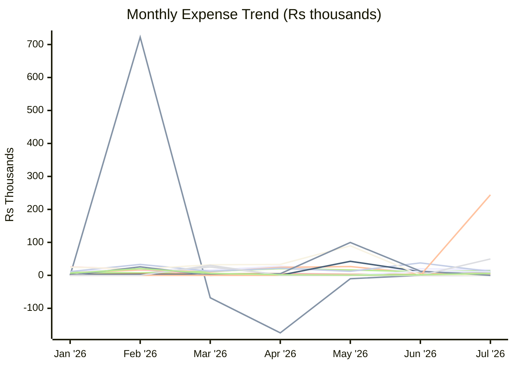
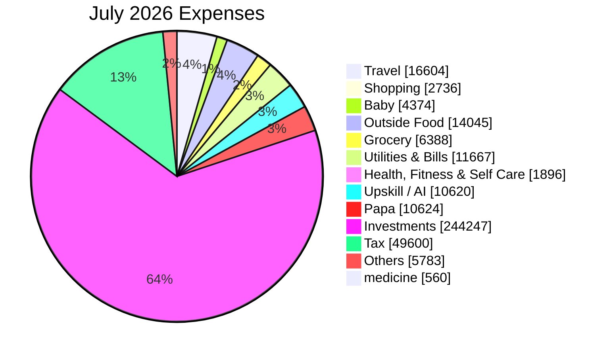

# Expense Report — July 2026

_Generated: 2026-08-02_

## Summary

| Category | July 2026 | May 2026 | Jun 2026 |
| --- | --- | --- | --- |
| Travel | ₹16,604 | ₹13,748 | ₹19,990 |
| Trip | ₹0 | (₹10,229) | ₹0 |
| Shopping | ₹2,736 | ₹26,816 | ₹5,332 |
| Baby | ₹4,374 | ₹1,050 | ₹750 |
| Outside Food | ₹14,045 | ₹16,425 | ₹11,230 |
| Grocery | ₹6,388 | ₹3,187 | ₹2,455 |
| Utilities & Bills | ₹11,667 | ₹12,317 | ₹37,663 |
| Health, Fitness & Self Care | ₹1,896 | ₹2,274 | ₹630 |
| Upskill / AI | ₹10,620 | ₹42,626 | ₹11,024 |
| Rohan | ₹0 | ₹89,604 | ₹1,075 |
| Papa | ₹10,624 | ₹0 | ₹12,500 |
| One-Time Expense | ₹0 | ₹99,711 | ₹12,663 |
| Investments | ₹244,247 | ₹0 | ₹0 |
| Tax | ₹49,600 | ₹0 | ₹0 |
| Others | ₹5,783 | ₹706 | ₹1,584 |
| **Total** | **₹378,585** | **₹298,235** | **₹116,895** |

---

**Lines:** Travel · Trip · Shopping · Baby · Outside Food · Grocery · Utilities & Bills · Health, Fitness & Self Care · Upskill / AI · Rohan · Papa · One-Time Expense · Investments · Tax · Others

---

## Travel

| Date | Merchant | Card | Amount |
| ---- | -------- | ---- | ------:|
| Jul 01 | Fuel | ICICI Emeralde | ₹2,044 |
| Jul 01 | Parking | Paytm | ₹60 |
| Jul 02 | Fuel Surcharge ↩ Refund | ICICI Emeralde | (₹20) |
| Jul 02 | Fuel Surcharge (GST) ↩ Refund | ICICI Emeralde | (₹4) |
| Jul 04 | Fuel | ICICI Emeralde | ₹2,044 |
| Jul 05 | Fuel Surcharge ↩ Refund | ICICI Emeralde | (₹20) |
| Jul 05 | Fuel Surcharge (GST) ↩ Refund | ICICI Emeralde | (₹4) |
| Jul 06 | IDBI FASTag | Paytm | ₹100 |
| Jul 07 | Fuel | ICICI Emeralde | ₹2,044 |
| Jul 07 | Parking | Paytm | ₹60 |
| Jul 08 | Fuel Surcharge ↩ Refund | ICICI Emeralde | (₹20) |
| Jul 08 | Fuel Surcharge (GST) ↩ Refund | ICICI Emeralde | (₹4) |
| Jul 08 | Fuel | ICICI Emeralde | ₹2,044 |
| Jul 09 | Fuel Surcharge ↩ Refund | ICICI Emeralde | (₹20) |
| Jul 09 | Fuel Surcharge (GST) ↩ Refund | ICICI Emeralde | (₹4) |
| Jul 11 | Fuel | ICICI Emeralde | ₹2,044 |
| Jul 12 | Fuel Surcharge ↩ Refund | ICICI Emeralde | (₹20) |
| Jul 12 | Fuel Surcharge (GST) ↩ Refund | ICICI Emeralde | (₹4) |
| Jul 14 | Fuel | ICICI Emeralde | ₹4,132 |
| Jul 15 | Fuel Surcharge ↩ Refund | ICICI Emeralde | (₹41) |
| Jul 15 | Fuel Surcharge (GST) ↩ Refund | ICICI Emeralde | (₹7) |
| Jul 17 | Fuel | ICICI Emeralde | ₹2,044 |
| Jul 18 | Fuel Surcharge ↩ Refund | ICICI Emeralde | (₹20) |
| Jul 18 | Fuel Surcharge (GST) ↩ Refund | ICICI Emeralde | (₹4) |
| Jul 21 | Md Israr (Fuel) | Paytm | ₹50 |
| Jul 25 | Noida Parking | Paytm | ₹30 |
| Jul 25 | FASTag Recharge | Paytm | ₹100 |
| | **Total** | | **₹16,604** |

## Shopping

| Date | Merchant | Card | Amount |
| ---- | -------- | ---- | ------:|
| Jul 11 | Reliance Retail | — | ₹1,061 |
| Jul 30 | Manpasand Collection | Paytm | ₹650 |
| Jul 30 | Manpasand Collection | Paytm | ₹800 |
| Jul 30 | Gulati Book Zone | Paytm | ₹225 |
| | **Total** | | **₹2,736** |

## Baby

| Date | Merchant | Card | Amount |
| ---- | -------- | ---- | ------:|
| Jul 07 | Rainbow Toys | — | ₹1,999 |
| Jul 09 | FirstCry | ICICI Emeralde | ₹2,375 |
| | **Total** | | **₹4,374** |

## Outside Food

| Date | Merchant | Card | Amount |
| ---- | -------- | ---- | ------:|
| Jul 01 | Chandan Kumar | Paytm | ₹20 |
| Jul 01 | Tim Tim Fresh | Paytm | ₹180 |
| Jul 05 | Blue Tokai | Paytm | ₹950 |
| Jul 07 | Swiggy | — | ₹270 |
| Jul 07 | Blue Tokai (Muhavra) | — | ₹641 |
| Jul 07 | Subway | Paytm | ₹230 |
| Jul 07 | Tim Tim Fresh | Paytm | ₹130 |
| Jul 07 | Tim Tim Fresh | Paytm | ₹105 |
| Jul 08 | Tim Tim Fresh | Paytm | ₹100 |
| Jul 08 | Tim Tim Fresh | Paytm | ₹80 |
| Jul 09 | Swiggy ↩ Refund | — | (₹27) |
| Jul 09 | Tim Tim Fresh | Paytm | ₹95 |
| Jul 09 | Tim Tim Fresh | Paytm | ₹70 |
| Jul 10 | Zomato | — | ₹1,155 |
| Jul 10 | Baba Ji Restaurant | Paytm | ₹150 |
| Jul 10 | Om Sweets | Paytm | ₹378 |
| Jul 11 | Swiggy (Bundl) | — | ₹1,035 |
| Jul 11 | Om Sweets | ICICI Emeralde | ₹660 |
| Jul 11 | Moolchand Parantha | Paytm | ₹180 |
| Jul 12 | Bikanervala | ICICI Emeralde | ₹688 |
| Jul 12 | Bikanervala | ICICI Emeralde | ₹399 |
| Jul 12 | Bikanervala | ICICI Emeralde | ₹709 |
| Jul 12 | Moolchand Parantha | Paytm | ₹90 |
| Jul 13 | Swiggy ↩ Refund | — | (₹104) |
| Jul 14 | Swiggy | — | ₹348 |
| Jul 14 | Tim Tim Fresh | Paytm | ₹125 |
| Jul 14 | Tim Tim Fresh | Paytm | ₹105 |
| Jul 15 | Connaught Plaza Restaurant | Paytm | ₹280 |
| Jul 15 | Tim Tim Fresh | Paytm | ₹25 |
| Jul 15 | Tim Tim Fresh | Paytm | ₹50 |
| Jul 16 | Swiggy ↩ Refund | — | (₹35) |
| Jul 16 | Swiggy | — | ₹2,325 |
| Jul 16 | Fresh N Up | Paytm | ₹100 |
| Jul 16 | Tim Tim Fresh | Paytm | ₹50 |
| Jul 18 | PVR Inox | — | ₹360 |
| Jul 19 | Amarjeet | Paytm | ₹30 |
| Jul 20 | McDonald's | — | ₹311 |
| Jul 20 | McDonald's | Paytm | ₹61 |
| Jul 21 | Amarjeet | Paytm | ₹50 |
| Jul 21 | Amarjeet | Paytm | ₹90 |
| Jul 21 | Tim Tim Fresh | Paytm | ₹60 |
| Jul 21 | Tim Tim Fresh | Paytm | ₹100 |
| Jul 22 | Swiggy | Paytm | ₹490 |
| Jul 22 | Tim Tim Fresh | Paytm | ₹100 |
| Jul 22 | Tim Tim Fresh | Paytm | ₹70 |
| Jul 23 | Tim Tim Fresh | Paytm | ₹105 |
| Jul 26 | McDonald's (CPRL) | Paytm | ₹86 |
| Jul 28 | Tim Tim Fresh | Paytm | ₹80 |
| Jul 29 | Tim Tim Fresh | Paytm | ₹135 |
| Jul 29 | Tim Tim Fresh | Paytm | ₹80 |
| Jul 30 | Subway | Paytm | ₹230 |
| Jul 30 | Tim Tim Fresh | Paytm | ₹50 |
| | **Total** | | **₹14,045** |

## Grocery

| Date | Merchant | Card | Amount |
| ---- | -------- | ---- | ------:|
| Jul 02 | Swiggy Instamart | — | ₹164 |
| Jul 02 | Blinkit | Paytm | ₹1,169 |
| Jul 02 | Blinkit | Paytm | ₹1,280 |
| Jul 11 | Shri Ram Paneer Bhandar | Paytm | ₹70 |
| Jul 12 | Innovative Retail | — | ₹1,143 |
| Jul 12 | Teerath | Paytm | ₹30 |
| Jul 12 | Sarifuddin | Paytm | ₹40 |
| Jul 12 | Teerath | Paytm | ₹20 |
| Jul 16 | Madhu Sharma | Paytm | ₹130 |
| Jul 16 | Madhu Sharma | Paytm | ₹500 |
| Jul 17 | Sumit Pal | Paytm | ₹83 |
| Jul 18 | Pawan Devi | Paytm | ₹50 |
| Jul 18 | Sethis Delicacy | Paytm | ₹390 |
| Jul 19 | Kprs Enterprises | Paytm | ₹200 |
| Jul 19 | Shri Ram Paneer Bhandar | Paytm | ₹115 |
| Jul 20 | Innovative Retail | — | ₹574 |
| Jul 23 | Shri Ram Paneer Bhandar | Paytm | ₹271 |
| Jul 25 | Swiggy Instamart | Paytm | ₹158 |
| | **Total** | | **₹6,388** |

## Utilities & Bills

| Date | Merchant | Card | Amount |
| ---- | -------- | ---- | ------:|
| Jul 11 | Airtel Mobile | Paytm | ₹1,415 |
| Jul 11 | Vi | Paytm | ₹886 |
| Jul 17 | Netflix | — | ₹499 |
| Jul 22 | Health Insurance EMI | — | ₹555 |
| Jul 22 | Health Insurance EMI | — | ₹8,312 |
| | **Total** | | **₹11,667** |

## Health, Fitness & Self Care

| Date | Merchant | Card | Amount |
| ---- | -------- | ---- | ------:|
| Jul 03 | Salon | Paytm | ₹1,680 |
| Jul 26 | Salon | Paytm | ₹150 |
| Jul 28 | Bhatia Medicos | Paytm | ₹66 |
| | **Total** | | **₹1,896** |

## Upskill / AI

| Date | Merchant | Card | Amount |
| ---- | -------- | ---- | ------:|
| Jul 03 | LinkedIn | — | ₹8,920 |
| Jul 04 | GreatFrontend | ICICI Emeralde | ₹1,700 |
| | **Total** | | **₹10,620** |

## Papa

| Date | Merchant | Card | Amount |
| ---- | -------- | ---- | ------:|
| Jul 10 | Bureau of Energy | — | ₹10,624 |
| | **Total** | | **₹10,624** |

## Investments

| Date | Merchant | Card | Amount |
| ---- | -------- | ---- | ------:|
| Jul 11 | NPS Trust | Paytm | ₹50,000 |
| Jul 11 | NPS Trust | Paytm | ₹50,000 |
| Jul 13 | Gold Coin | — | ₹72,658 |
| Jul 13 | Gold Coin | — | ₹71,589 |
| | **Total** | | **₹244,247** |

## Tax

| Date | Merchant | Card | Amount |
| ---- | -------- | ---- | ------:|
| Jul 17 | Tin 2 O | Paytm | ₹49,600 |
| | **Total** | | **₹49,600** |

## Others

| Date | Merchant | Card | Amount |
| ---- | -------- | ---- | ------:|
| Jul 04 | DCC Fee | ICICI Emeralde | ₹34 |
| Jul 04 | IGST | ICICI Emeralde | ₹6 |
| Jul 11 | Munder | Paytm | ₹120 |
| Jul 15 | Roshni Kumari | Paytm | ₹104 |
| Jul 16 | Prems Shop | Paytm | ₹160 |
| Jul 17 | Himanshu Singh | Paytm | ₹1,180 |
| Jul 20 | Kiran X | Paytm | ₹30 |
| Jul 20 | Poonam Singh | Paytm | ₹30 |
| Jul 20 | Shobha Devi | Paytm | ₹80 |
| Jul 22 | FCY Markup Fee | — | ₹89 |
| Jul 25 | Yogesh Kumar | Paytm | ₹3,000 |
| Jul 30 | Yash Vohra | Paytm | ₹950 |
| | **Total** | | **₹5,783** |
