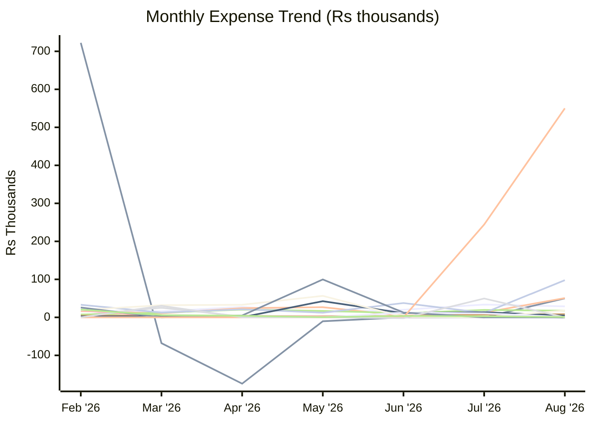
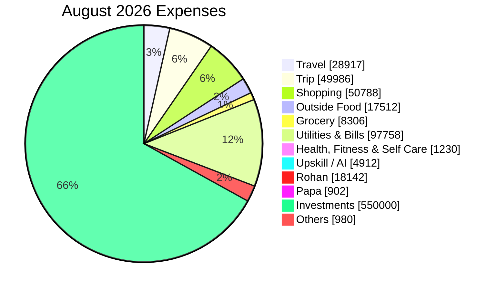

# Expense Report — August 2026

_Generated: 2026-09-02_

## Summary

| Category | August 2026 | Jun 2026 | Jul 2026 |
| --- | --- | --- | --- |
| Travel | ₹28,917 | ₹19,990 | ₹33,583 |
| Trip | ₹49,986 | ₹0 | ₹0 |
| Shopping | ₹50,788 | ₹4,271 | ₹12,740 |
| Baby | (₹1,657) | ₹750 | ₹12,769 |
| Outside Food | ₹17,512 | ₹11,230 | ₹19,412 |
| Grocery | ₹8,306 | ₹3,515 | ₹7,449 |
| Utilities & Bills | ₹97,758 | ₹37,663 | ₹11,667 |
| Health, Fitness & Self Care | ₹1,230 | ₹630 | ₹2,456 |
| Upskill / AI | ₹4,912 | ₹11,024 | ₹13,300 |
| Rohan | ₹18,142 | ₹1,075 | (₹45) |
| Papa | ₹902 | ₹12,500 | ₹10,624 |
| One-Time Expense | ₹0 | ₹12,663 | ₹0 |
| Investments | ₹550,000 | ₹0 | ₹244,247 |
| Tax | ₹0 | (₹2,079) | ₹49,600 |
| Others | ₹980 | ₹3,663 | ₹2,900 |
| **Total** | **₹827,776** | **₹116,895** | **₹420,702** |

---

**Lines:** Travel · Trip · Shopping · Baby · Outside Food · Grocery · Utilities & Bills · Health, Fitness & Self Care · Upskill / AI · Rohan · Papa · One-Time Expense · Investments · Tax · Others

---

## Travel

| Date | Merchant | Card | Amount |
| ---- | -------- | ---- | ------:|
| Aug 01 | Fuel Surcharge ↩ Refund | ICICI Emeralde | (₹20) |
| Aug 01 | Fuel Surcharge (GST) ↩ Refund | ICICI Emeralde | (₹4) |
| Aug 04 | Fuel | ICICI Emeralde | ₹4,102 |
| Aug 04 | Parking | Paytm | ₹60 |
| Aug 05 | Fuel Surcharge ↩ Refund | ICICI Emeralde | (₹41) |
| Aug 05 | Fuel Surcharge (GST) ↩ Refund | ICICI Emeralde | (₹7) |
| Aug 08 | Fuel | ICICI Emeralde | ₹2,044 |
| Aug 08 | DLF Avenue Saket | Paytm | ₹180 |
| Aug 09 | Fuel Surcharge ↩ Refund | ICICI Emeralde | (₹20) |
| Aug 09 | Fuel Surcharge (GST) ↩ Refund | ICICI Emeralde | (₹4) |
| Aug 11 | Fuel | — | ₹4,118 |
| Aug 11 | Fuel Surcharge ↩ Refund | — | (₹41) |
| Aug 11 | IDBI FASTag | Paytm | ₹300 |
| Aug 15 | HP Petrol | ICICI Emeralde | ₹2,044 |
| Aug 15 | Fuel | Paytm | ₹2,020 |
| Aug 16 | Fuel Surcharge ↩ Refund | ICICI Emeralde | (₹20) |
| Aug 16 | Fuel Surcharge (GST) ↩ Refund | ICICI Emeralde | (₹4) |
| Aug 17 | Fuel | Paytm | ₹2,020 |
| Aug 18 | Cityflo | PhonePe | ₹209 |
| Aug 19 | Narain Service Station | — | ₹2,044 |
| Aug 19 | Fuel Surcharge ↩ Refund | — | (₹20) |
| Aug 19 | IDBI FASTag | Paytm | ₹500 |
| Aug 19 | Cityflo | PhonePe | ₹312 |
| Aug 21 | Fuel | — | ₹3,580 |
| Aug 21 | Fuel Surcharge ↩ Refund | — | (₹35) |
| Aug 22 | ICICI FASTag | Paytm | ₹500 |
| Aug 25 | Cityflo | Paytm | ₹885 |
| Aug 26 | Airport Lounge Refund ↩ Refund | — | (₹2) |
| Aug 26 | Airport Lounge | — | ₹2 |
| Aug 26 | Delhi Airport Parking | Paytm | ₹320 |
| Aug 27 | Fuel Surcharge ↩ Refund | — | (₹39) |
| Aug 27 | Fuel | — | ₹3,935 |
| | **Total** | | **₹28,917** |

## Trip

| Date | Merchant | Card | Amount |
| ---- | -------- | ---- | ------:|
| Aug 07 | CT HOTEL VIA SMARTBUY | — | ₹49,986 |
| | **Total** | | **₹49,986** |

## Shopping

| Date | Merchant | Card | Amount |
| ---- | -------- | ---- | ------:|
| Aug 01 | Monika Myntra ↩ Refund | — | (₹1,039) |
| Aug 01 | Monika Myntra ↩ Refund | — | (₹874) |
| Aug 01 | Monika Myntra ↩ Refund | — | (₹929) |
| Aug 02 | Monika Myntra | — | ₹3,535 |
| Aug 02 | Myntra | — | ₹3,579 |
| Aug 06 | Monika FableStreet | — | ₹5,723 |
| Aug 06 | Monika Myntra ↩ Refund | — | (₹1,206) |
| Aug 07 | Amazon | — | ₹2,332 |
| Aug 08 | Uniqlo | — | ₹9,440 |
| Aug 08 | IKEA | ICICI Emeralde | ₹2,049 |
| Aug 10 | Monika Azorte | — | ₹2,598 |
| Aug 10 | Monika H&M | — | ₹8,394 |
| Aug 10 | Market 99 | ICICI Emeralde | ₹338 |
| Aug 10 | Amazon | Paytm | ₹152 |
| Aug 12 | Monika FableStreet ↩ Refund | — | (₹1,544) |
| Aug 12 | Monika FableStreet ↩ Refund | — | (₹1,221) |
| Aug 12 | Monika FableStreet ↩ Refund | — | (₹1,479) |
| Aug 12 | Monika Myntra ↩ Refund | — | (₹1,210) |
| Aug 14 | Monika Marks & Spencer | — | ₹5,523 |
| Aug 14 | Monika Westside (Trent) | — | ₹10,576 |
| Aug 20 | Vikas Garg | Paytm | ₹500 |
| Aug 22 | Monika Myntra ↩ Refund | — | (₹1,499) |
| Aug 22 | Monika Myntra ↩ Refund | — | (₹2,408) |
| Aug 22 | Monika Myntra ↩ Refund | — | (₹2,408) |
| Aug 22 | Monika Myntra | — | ₹6,315 |
| Aug 24 | Amazon (iPhone Charger) | — | ₹3,979 |
| Aug 28 | Monika Myntra (Denim Top) | — | ₹1,422 |
| Aug 28 | Karuna | Paytm | ₹150 |
| | **Total** | | **₹50,788** |

## Baby

| Date | Merchant | Card | Amount |
| ---- | -------- | ---- | ------:|
| Aug 01 | Hopscotch ↩ Refund | — | (₹2,644) |
| Aug 01 | Hopscotch ↩ Refund | — | (₹1,881) |
| Aug 10 | FirstCry | ICICI Emeralde | ₹1,437 |
| Aug 22 | FirstCry | ICICI Emeralde | ₹1,430 |
| | **Total** | | **(₹1,657)** |

## Outside Food

| Date | Merchant | Card | Amount |
| ---- | -------- | ---- | ------:|
| Aug 04 | Tim Tim Fresh | Paytm | ₹195 |
| Aug 04 | Tim Tim Fresh | Paytm | ₹50 |
| Aug 05 | Tim Tim Fresh | Paytm | ₹95 |
| Aug 06 | Fresh N Up | Paytm | ₹177 |
| Aug 06 | Tim Tim Fresh | Paytm | ₹80 |
| Aug 08 | Laylas | — | ₹334 |
| Aug 08 | SI Bang Hospitality | — | ₹950 |
| Aug 08 | EazyDiner | ICICI Emeralde | ₹1,640 |
| Aug 09 | Swiggy | — | ₹354 |
| Aug 09 | Blue Tokai | — | ₹1,061 |
| Aug 11 | Swiggy Cashback ↩ Refund | — | (₹35) |
| Aug 11 | PHD ILD Trade Centre | Paytm | ₹302 |
| Aug 11 | Tim Tim Fresh | Paytm | ₹15 |
| Aug 11 | Tim Tim Fresh | Paytm | ₹100 |
| Aug 12 | Swiggy | — | ₹348 |
| Aug 12 | Tim Tim Fresh | Paytm | ₹60 |
| Aug 12 | Tim Tim Fresh | Paytm | ₹75 |
| Aug 14 | Swiggy Cashback ↩ Refund | — | (₹35) |
| Aug 16 | Haveli T1 | Paytm | ₹1,190 |
| Aug 18 | Da Palermo Pizzeria | — | ₹1,391 |
| Aug 18 | Chaayos | — | ₹425 |
| Aug 18 | Tim Tim Fresh | Paytm | ₹100 |
| Aug 19 | Tim Tim Fresh | Paytm | ₹70 |
| Aug 19 | Tim Tim Fresh | Paytm | ₹130 |
| Aug 19 | Tim Tim Fresh | Paytm | ₹100 |
| Aug 22 | Fresh N Up | Paytm | ₹135 |
| Aug 22 | Fresh N Up | Paytm | ₹188 |
| Aug 25 | Swiggy | — | ₹737 |
| Aug 25 | Sodexo Adobe | Paytm | ₹27 |
| Aug 26 | Tim Tim Fresh | Paytm | ₹220 |
| Aug 27 | Cafe Parmesan | Paytm | ₹987 |
| Aug 27 | Tim Tim Fresh | Paytm | ₹70 |
| Aug 27 | Tim Tim Fresh | Paytm | ₹120 |
| Aug 28 | Baba Ji Restaurant | Paytm | ₹100 |
| Aug 29 | Baba Sri Chand | — | ₹1,050 |
| Aug 29 | Museum of Illusions | — | ₹299 |
| Aug 29 | Museum of Illusions | — | ₹2,041 |
| Aug 29 | Museum of Illusions | — | ₹299 |
| Aug 29 | Big Chill Cakery | — | ₹1,310 |
| Aug 29 | Art Cafe Teen Murti | Paytm | ₹422 |
| Aug 30 | Swiggy | — | ₹334 |
| | **Total** | | **₹17,512** |

## Grocery

| Date | Merchant | Card | Amount |
| ---- | -------- | ---- | ------:|
| Aug 02 | BigBasket | — | ₹494 |
| Aug 05 | S Sons | Paytm | ₹115 |
| Aug 09 | Kprs Enterprises | Paytm | ₹200 |
| Aug 10 | BigBasket | — | ₹812 |
| Aug 11 | Blinkit | Paytm | ₹650 |
| Aug 14 | Instamart | — | ₹149 |
| Aug 14 | Sonu | Paytm | ₹170 |
| Aug 16 | Kprs Enterprises | Paytm | ₹200 |
| Aug 16 | Shri Ram Paneer Bhandar | Paytm | ₹381 |
| Aug 18 | Anil Kumar | Paytm | ₹750 |
| Aug 20 | Tanuj Gupta | Paytm | ₹314 |
| Aug 22 | Innovative Retail | — | ₹383 |
| Aug 22 | Kprs Enterprises | Paytm | ₹295 |
| Aug 22 | Sethis Delicacy | Paytm | ₹845 |
| Aug 22 | Sindhi Namkeen & Dryfruits | Paytm | ₹53 |
| Aug 22 | Sindhi Namkeen & Dryfruits | Paytm | ₹507 |
| Aug 22 | Shri Ram Paneer Bhandar | Paytm | ₹271 |
| Aug 25 | Blinkit | Paytm | ₹297 |
| Aug 27 | PK Dept Store | Paytm | ₹45 |
| Aug 27 | Bijendra Kumar | Paytm | ₹20 |
| Aug 27 | S Sons | Paytm | ₹65 |
| Aug 28 | Shri Ram Paneer | Paytm | ₹302 |
| Aug 29 | Seema Devi | Paytm | ₹40 |
| Aug 29 | Shri Ram Paneer | Paytm | ₹452 |
| Aug 29 | Kapil Dev | Paytm | ₹80 |
| Aug 30 | Amazon Pay | Paytm | ₹416 |
| | **Total** | | **₹8,306** |

## Utilities & Bills

| Date | Merchant | Card | Amount |
| ---- | -------- | ---- | ------:|
| Aug 02 | Vodafone Idea | — | ₹886 |
| Aug 02 | Reliance Jio | — | ₹1,061 |
| Aug 04 | Google Cloud | Paytm | ₹2 |
| Aug 09 | Airtel | — | ₹1,415 |
| Aug 15 | Amazon Prime | — | ₹1,499 |
| Aug 16 | Netflix | — | ₹499 |
| Aug 22 | Health Insurance EMI | — | ₹8,402 |
| Aug 22 | Health Insurance EMI | — | ₹465 |
| Aug 25 | YouTube | Paytm | ₹2 |
| Aug 28 | DHBVN | — | ₹34,045 |
| Aug 28 | Max Life Insurance | — | ₹11,667 |
| Aug 29 | ICICI Pru Life Insurance | — | ₹14,865 |
| Aug 30 | HDFC Life Insurance | — | ₹22,950 |
| | **Total** | | **₹97,758** |

## Health, Fitness & Self Care

| Date | Merchant | Card | Amount |
| ---- | -------- | ---- | ------:|
| Aug 09 | Salon | Paytm | ₹1,050 |
| Aug 30 | Salon | Paytm | ₹180 |
| | **Total** | | **₹1,230** |

## Upskill / AI

| Date | Merchant | Card | Amount |
| ---- | -------- | ---- | ------:|
| Aug 02 | Anthropic | — | ₹2,253 |
| Aug 12 | Google Cloud | — | ₹2 |
| Aug 19 | Google Cloud Refund ↩ Refund | — | (₹2) |
| Aug 25 | Anthropic | — | ₹2,260 |
| Aug 28 | ChatGPT / OpenAI | — | ₹399 |
| | **Total** | | **₹4,912** |

## Rohan

| Date | Merchant | USD | Card | Amount |
| ---- | -------- | --- | ---- | ------:|
| Aug 13 | Rohan Lifestyle | — | — | ₹5,250 |
| Aug 13 | Rohan Westside (Trent) | — | — | ₹1,007 |
| Aug 15 | Rohan Stanmax | — | — | ₹5,878 |
| Aug 22 | Rohan Myntra ↩ Refund | — | — | (₹1,179) |
| Aug 22 | Rohan Myntra ↩ Refund | — | — | (₹1,495) |
| Aug 22 | Rohan Myntra ↩ Refund | — | — | (₹1,259) |
| Aug 22 | Rohan Myntra ↩ Refund | — | — | (₹702) |
| Aug 22 | Rohan Myntra ↩ Refund | — | — | (₹1,007) |
| Aug 22 | Rohan Myntra | — | — | ₹10,833 |
| Aug 23 | Rohan Myntra ↩ Refund | — | — | (₹1,279) |
| Aug 23 | Rohan Myntra | — | — | ₹13,109 |
| Aug 23 | Global Value Cash Back ↩ Refund | — | — | (₹45) |
| Aug 25 | Rohan Myntra ↩ Refund | — | — | (₹2,408) |
| Aug 25 | Rohan Myntra ↩ Refund | — | — | (₹2,408) |
| Aug 25 | Rohan Amazon (Tawa) | — | — | ₹2,245 |
| Aug 27 | Rohan Myntra ↩ Refund | — | — | (₹1,553) |
| Aug 27 | Rohan Myntra ↩ Refund | — | — | (₹702) |
| Aug 27 | Rohan Myntra ↩ Refund | — | — | (₹1,279) |
| Aug 27 | Rohan Myntra ↩ Refund | — | — | (₹1,179) |
| Aug 29 | Rohan Myntra ↩ Refund | — | — | (₹2,336) |
| Aug 29 | Rohan Myntra ↩ Refund | — | — | (₹1,349) |
| | **Total** | | | **₹18,142** |

## Papa

| Date | Merchant | Card | Amount |
| ---- | -------- | ---- | ------:|
| Aug 28 | Jio Recharge (Papa) | Paytm | ₹902 |
| | **Total** | | **₹902** |

## Investments

| Date | Merchant | Card | Amount |
| ---- | -------- | ---- | ------:|
| Aug 05 | INDmoney | Paytm | ₹400,000 |
| Aug 17 | INDmoney | Paytm | ₹150,000 |
| | **Total** | | **₹550,000** |

## Others

| Date | Merchant | Card | Amount |
| ---- | -------- | ---- | ------:|
| Aug 02 | Amazon Pay Load | Paytm | ₹125 |
| Aug 03 | IGST | — | ₹8 |
| Aug 22 | FCY Markup Fee | — | ₹91 |
| Aug 22 | IGST | — | ₹84 |
| Aug 25 | IGST | — | ₹8 |
| Aug 25 | FCY Markup Fee | — | ₹45 |
| Aug 27 | Sindhi Namkeen | Paytm | ₹340 |
| Aug 29 | PM Museum | Paytm | ₹270 |
| Aug 30 | IGST | — | ₹1 |
| Aug 30 | DCC Fee | — | ₹7 |
| Aug 31 | Indstocks Verify | Paytm | ₹1 |
| | **Total** | | **₹980** |
