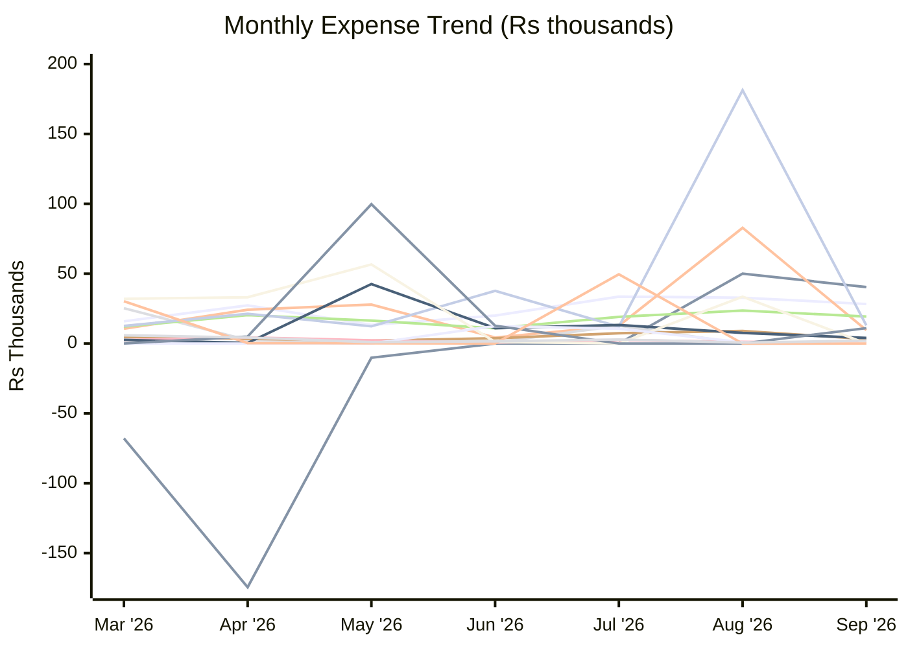
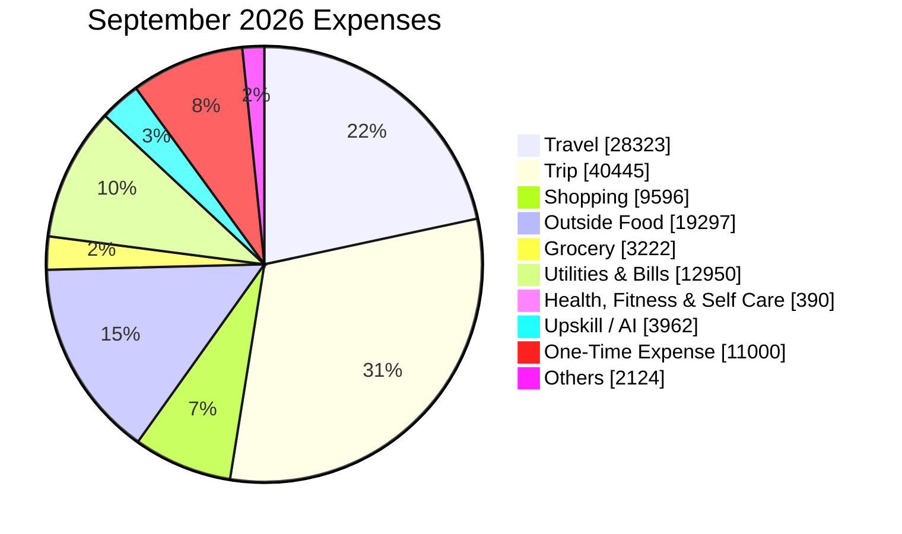
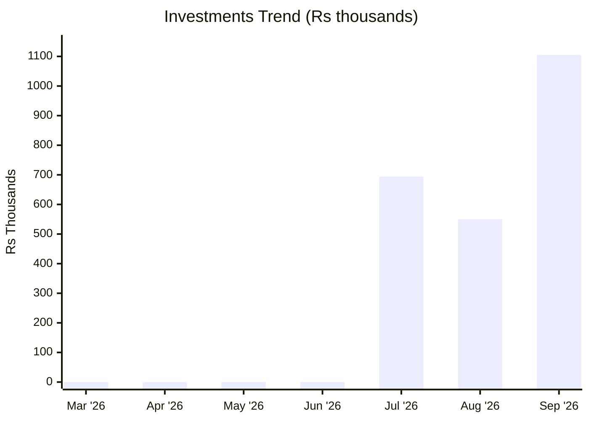

# Expense Report — September 2026

_Generated: 2026-10-03_

## Summary

| Category | September 2026 | Jul 2026 | Aug 2026 |
| --- | --- | --- | --- |
| Travel | ₹28,323 | ₹33,583 | ₹32,813 |
| Trip | ₹40,445 | ₹0 | ₹49,986 |
| Shopping | ₹9,596 | ₹12,740 | ₹82,764 |
| Baby | ₹0 | ₹12,769 | (₹227) |
| Outside Food | ₹19,297 | ₹19,052 | ₹23,583 |
| Grocery | ₹3,222 | ₹7,449 | ₹9,029 |
| Utilities & Bills | ₹12,950 | ₹12,027 | ₹181,285 |
| Health, Fitness & Self Care | ₹390 | ₹2,456 | ₹1,230 |
| Upskill / AI | ₹3,962 | ₹13,300 | ₹7,571 |
| Rohan | (₹23) | (₹45) | ₹33,450 |
| Nitin | ₹29,885 | ₹0 | ₹0 |
| Papa | ₹0 | ₹10,624 | ₹902 |
| One-Time Expense | ₹11,000 | ₹0 | ₹0 |
| Investments | ₹1,104,797 | ₹694,247 | ₹550,000 |
| Tax | ₹0 | ₹49,600 | ₹0 |
| Others | ₹2,124 | ₹2,900 | ₹615 |
| **Total** | **₹131,310** | **₹176,500** | **₹389,552** |

---

**Lines:** Travel · Trip · Shopping · Baby · Outside Food · Grocery · Utilities & Bills · Health, Fitness & Self Care · Upskill / AI · Rohan · Papa · One-Time Expense · Tax · Others

---

## Travel

| Date | Merchant | Card | Amount |
| ---- | -------- | ---- | ------:|
| Sep 01 | Fuel | — | ₹3,268 |
| Sep 01 | Fuel Surcharge ↩ Refund | — | (₹32) |
| Sep 02 | Cityflo | Paytm | ₹298 |
| Sep 03 | Fuel | — | ₹526 |
| Sep 03 | Fuel Surcharge ↩ Refund | — | (₹5) |
| Sep 04 | Auto Care Fuel | Paytm | ₹520 |
| Sep 05 | Fuel | — | ₹2,044 |
| Sep 05 | Fuel Surcharge ↩ Refund | — | (₹20) |
| Sep 07 | Komorebi Tech | Paytm | ₹885 |
| Sep 09 | Fuel | — | ₹2,044 |
| Sep 09 | Fuel Surcharge ↩ Refund | — | (₹20) |
| Sep 12 | Fuel | — | ₹2,524 |
| Sep 12 | Fuel Surcharge ↩ Refund | — | (₹25) |
| Sep 12 | ICICI FASTag | Paytm | ₹1,500 |
| Sep 14 | Fuel | — | ₹3,056 |
| Sep 14 | Fuel Surcharge ↩ Refund | — | (₹30) |
| Sep 14 | Komorebi Tech | Paytm | ₹945 |
| Sep 21 | Fuel | — | ₹2,044 |
| Sep 21 | Fuel Surcharge ↩ Refund | — | (₹20) |
| Sep 21 | Komorebi Tech | Paytm | ₹945 |
| Sep 22 | Fuel Surcharge ↩ Refund | — | (₹30) |
| Sep 22 | Fuel | — | ₹3,018 |
| Sep 28 | Komorebi Tech | Paytm | ₹945 |
| Sep 29 | Fuel Surcharge ↩ Refund | — | (₹38) |
| Sep 29 | Fuel | — | ₹3,883 |
| Sep 30 | Parkmate Parking | Paytm | ₹100 |
| | **Total** | | **₹28,323** |

## Trip

| Date | Merchant | Card | Amount |
| ---- | -------- | ---- | ------:|
| Sep 12 | MMT HOTEL VIA SMARTBU | — | ₹34,558 |
| Sep 12 | Hotel Tokas | Paytm | ₹250 |
| Sep 14 | ITC Rajputana | — | ₹5,637 |
| | **Total** | | **₹40,445** |

## Shopping

| Date | Merchant | Card | Amount |
| ---- | -------- | ---- | ------:|
| Sep 03 | Lata Verma | Paytm | ₹70 |
| Sep 03 | Lata Verma | Paytm | ₹250 |
| Sep 05 | Amazon | — | ₹2,240 |
| Sep 11 | Mom's Kids Corner | Paytm | ₹2,000 |
| Sep 13 | Durga Textiles | Paytm | ₹600 |
| Sep 19 | Miniso | — | ₹850 |
| Sep 19 | Metro Brands | — | ₹2,990 |
| Sep 20 | Amazon | — | ₹596 |
| | **Total** | | **₹9,596** |

## Outside Food

| Date | Merchant | Card | Amount |
| ---- | -------- | ---- | ------:|
| Sep 01 | Swiggy Cashback ↩ Refund | — | (₹33) |
| Sep 01 | Sodexo Adobe | Paytm | ₹18 |
| Sep 01 | Tim Tim Fresh | Paytm | ₹100 |
| Sep 02 | Swiggy | — | ₹473 |
| Sep 02 | Sodexo Adobe | Paytm | ₹18 |
| Sep 02 | Tim Tim Fresh | Paytm | ₹60 |
| Sep 02 | Tim Tim Fresh | Paytm | ₹20 |
| Sep 02 | Tim Tim Fresh | Paytm | ₹70 |
| Sep 03 | Sodexo Adobe | Paytm | ₹18 |
| Sep 03 | Tim Tim Fresh | Paytm | ₹100 |
| Sep 04 | Swiggy | — | ₹347 |
| Sep 05 | Fresh N Up | Paytm | ₹100 |
| Sep 06 | Cafe Cavello | Paytm | ₹1,577 |
| Sep 08 | Sodexo Adobe | Paytm | ₹21 |
| Sep 08 | McDonald's (CPRL) | Paytm | ₹226 |
| Sep 08 | Tim Tim Fresh | Paytm | ₹130 |
| Sep 08 | Tim Tim Fresh | Paytm | ₹70 |
| Sep 09 | Tim Tim Fresh | Paytm | ₹130 |
| Sep 09 | Tim Tim Fresh | Paytm | ₹70 |
| Sep 10 | Swiggy | — | ₹367 |
| Sep 10 | Swiggy | — | ₹508 |
| Sep 12 | Swiggy Cashback ↩ Refund | — | (₹88) |
| Sep 13 | Tapri Central | Paytm | ₹556 |
| Sep 13 | S Lassi Wala | Paytm | ₹50 |
| Sep 13 | S Lassi Wala | Paytm | ₹50 |
| Sep 13 | S Lassi Wala | Paytm | ₹200 |
| Sep 13 | Akshat Agarwal | Paytm | ₹20 |
| Sep 14 | Om Sweets | — | ₹640 |
| Sep 15 | Swiggy | — | ₹422 |
| Sep 16 | McDonald's (CPRL) | Paytm | ₹226 |
| Sep 16 | Tim Tim Fresh | Paytm | ₹70 |
| Sep 17 | Swiggy Cashback ↩ Refund | — | (₹42) |
| Sep 17 | Tim Tim Fresh | Paytm | ₹130 |
| Sep 17 | Tim Tim Fresh | Paytm | ₹100 |
| Sep 18 | Swiggy | — | ₹404 |
| Sep 18 | Swiggy | — | ₹422 |
| Sep 18 | Zomato | — | ₹814 |
| Sep 19 | Cafe Parmesan | — | ₹1,197 |
| Sep 19 | Coconut Water | Paytm | ₹120 |
| Sep 20 | Swiggy | — | ₹491 |
| Sep 20 | Swiggy Cashback ↩ Refund | — | (₹83) |
| Sep 22 | Swiggy Cashback Reversal | — | ₹49 |
| Sep 22 | Swiggy Cashback ↩ Refund | — | (₹49) |
| Sep 22 | Sodexo Adobe | Paytm | ₹18 |
| Sep 22 | McDonald's | Paytm | ₹109 |
| Sep 22 | Tim Tim Fresh | Paytm | ₹80 |
| Sep 23 | Tim Tim Fresh | Paytm | ₹140 |
| Sep 23 | Tim Tim Fresh | Paytm | ₹80 |
| Sep 24 | Swiggy | — | ₹364 |
| Sep 24 | Sodexo Adobe | Paytm | ₹18 |
| Sep 26 | Swiggy | — | ₹577 |
| Sep 26 | Swiggy Cashback ↩ Refund | — | (₹36) |
| Sep 26 | Nai Coffee Roastery | Paytm | ₹784 |
| Sep 27 | Funky Kingdom | — | ₹2,500 |
| Sep 27 | Eiko Patisserie | — | ₹870 |
| Sep 27 | Keventers | — | ₹263 |
| Sep 28 | Swiggy Cashback ↩ Refund | — | (₹58) |
| Sep 28 | Sohan Sweets | Paytm | ₹70 |
| Sep 29 | Sodexo Adobe | Paytm | ₹18 |
| Sep 29 | Sodexo Adobe | Paytm | ₹21 |
| Sep 29 | Tim Tim Fresh | Paytm | ₹130 |
| Sep 29 | Tim Tim Fresh | Paytm | ₹80 |
| Sep 30 | Unlocked Gurgaon | — | ₹2,960 |
| Sep 30 | Tim Tim Fresh | Paytm | ₹130 |
| Sep 30 | Sambhu | Paytm | ₹90 |
| | **Total** | | **₹19,297** |

## Grocery

| Date | Merchant | Card | Amount |
| ---- | -------- | ---- | ------:|
| Sep 01 | Shri Ram Paneer | Paytm | ₹222 |
| Sep 04 | Shri Ram Paneer | Paytm | ₹80 |
| Sep 04 | Kprs Enterprises | Paytm | ₹390 |
| Sep 05 | Kprs Enterprises | Paytm | ₹200 |
| Sep 08 | Innovative Retail | — | ₹286 |
| Sep 08 | Kprs Enterprises | Paytm | ₹200 |
| Sep 09 | S Sons | Paytm | ₹90 |
| Sep 16 | Kprs Enterprises | Paytm | ₹200 |
| Sep 19 | Ranjeet Kumar | Paytm | ₹50 |
| Sep 19 | Swiggy Instamart | Paytm | ₹302 |
| Sep 21 | Kprs Enterprises | Paytm | ₹200 |
| Sep 21 | Swiggy Instamart | Paytm | ₹152 |
| Sep 23 | S Sons | Paytm | ₹90 |
| Sep 27 | Shri Ram Paneer | Paytm | ₹5 |
| Sep 28 | Seema Devi | Paytm | ₹85 |
| Sep 28 | Shri Ram Paneer | Paytm | ₹400 |
| Sep 30 | Kprs Enterprises | Paytm | ₹270 |
| | **Total** | | **₹3,222** |

## Utilities & Bills

| Date | Merchant | Card | Amount |
| ---- | -------- | ---- | ------:|
| Sep 09 | Vodafone Idea | — | ₹890 |
| Sep 09 | Airtel | — | ₹1,415 |
| Sep 09 | Reliance Jio | — | ₹1,061 |
| Sep 15 | Netflix | — | ₹499 |
| Sep 22 | Health Insurance EMI | — | ₹8,493 |
| Sep 22 | Health Insurance EMI | — | ₹374 |
| Sep 25 | YouTube | Paytm | ₹219 |
| | **Total** | | **₹12,950** |

## Health, Fitness & Self Care

| Date | Merchant | Card | Amount |
| ---- | -------- | ---- | ------:|
| Sep 08 | Bhatia Medicos | Paytm | ₹40 |
| Sep 16 | Bhatia Medicos | Paytm | ₹260 |
| Sep 23 | Bhatia Medicos | Paytm | ₹90 |
| | **Total** | | **₹390** |

## Upskill / AI

| Date | Merchant | Card | Amount |
| ---- | -------- | ---- | ------:|
| Sep 04 | Cosmofeed | Paytm | ₹1,298 |
| Sep 25 | Anthropic | — | ₹2,265 |
| Sep 28 | ChatGPT / OpenAI | — | ₹399 |
| | **Total** | | **₹3,962** |

## Rohan

| Date | Merchant | USD | Card | Amount |
| ---- | -------- | --- | ---- | ------:|
| Sep 23 | Global Value Cash Back ↩ Refund | — | — | (₹23) |
| | **Total** | | | **(₹23)** |

## Nitin

| Date | Merchant | Card | Amount |
| ---- | -------- | ---- | ------:|
| Sep 17 | Reward360 (Nitin) | ICICI Emeralde | ₹29,885 |
| | **Total** | | **₹29,885** |

## One-Time Expense

| Date | Merchant | Card | Amount |
| ---- | -------- | ---- | ------:|
| Sep 21 | Tata Motors | Paytm | ₹11,000 |
| | **Total** | | **₹11,000** |

## Investments

| Date | Merchant | Card | Amount |
| ---- | -------- | ---- | ------:|
| Sep 04 | Gold Coin | — | ₹79,092 |
| Sep 09 | Gold Coin | — | ₹78,042 |
| Sep 15 | Gold Coin | — | ₹151,698 |
| Sep 15 | IndMoney | — | ₹450,000 |
| Sep 16 | IndMoney | — | ₹550,000 |
| Sep 22 | IndMoney (TCS ₹72,844) | — | ₹377,156 |
| Sep 22 | Zerodha (India→US) ↩ Refund | — | (₹656,004) |
| Sep 28 | Gold Coin | — | ₹74,813 |
| | **Total** | | **₹1,104,797** |

## Others

| Date | Merchant | Card | Amount |
| ---- | -------- | ---- | ------:|
| Sep 05 | Saurav Varshney | Paytm | ₹184 |
| Sep 05 | UPI Transfer | Paytm | ₹50 |
| Sep 17 | Amarjeet Singh | Paytm | ₹669 |
| Sep 17 | Mahesh Kamat | Paytm | ₹691 |
| Sep 19 | Mr Kuldeep | Paytm | ₹18 |
| Sep 20 | Pronto | Paytm | ₹83 |
| Sep 20 | Pronto | Paytm | ₹83 |
| Sep 21 | Prems Shop | Paytm | ₹12 |
| Sep 21 | Anubhav Jha | Paytm | ₹159 |
| Sep 22 | FCY Markup Fee | — | ₹45 |
| Sep 22 | IGST Charge | — | ₹67 |
| Sep 22 | Indstocks | Paytm | ₹1 |
| Sep 25 | IGST Charge | — | ₹8 |
| Sep 25 | FCY Markup Fee | — | ₹45 |
| Sep 30 | IGST Charge | — | ₹1 |
| Sep 30 | DCC Charge | — | ₹7 |
| | **Total** | | **₹2,124** |
